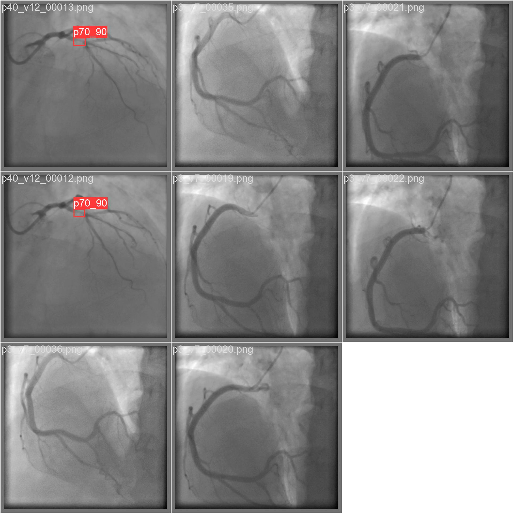

# Atherosclerosis Detection

## Project Description

This project focuses on the detection of coronary artery disease using deep learning techniques, specifically the YOLO (You Only Look Once) object detection algorithm. The dataset utilized for this project is the CADICA dataset, a newly published resource for coronary artery disease research. The CADICA dataset, authored by Jiménez-Partinen et al. (2024), includes annotated coronary angiograms and provides bounding boxes around lesions. The bounding boxes are initially provided in a format specifying the top-left corner coordinates, width, and height. For this project, these annotations are transformed into the YOLO format, which requires normalized coordinates for the center of the bounding box, along with its width and height.

The dataset is split into training, validation, and test sets, with corresponding CSV files detailing the paths to the images and their ground truth annotations. The project involves the creation of a `DatasetGenerator` class that organizes these splits into the YOLO-required directory structure, converting the bounding box coordinates to the necessary format and ensuring compatibility with the YOLO algorithm. This allows for efficient and effective training of the YOLO model on the CADICA dataset. For more details about the dataset, you can access it [here](https://data.mendeley.com/datasets/p9bpx9ctcv/2).

  

## References
Jiménez-Partinen, Ariadna; Molina-Cabello, Miguel A.; Thurnhofer-Hemsi, Karl; Palomo, Esteban; Rodríguez-Capitán, Jorge; Molina-Ramos, Ana I.; Jiménez-Navarro, Manuel (2024), “CADICA: a new dataset for coronary artery disease”, Mendeley Data, V2, doi: 10.17632/p9bpx9ctcv.2
