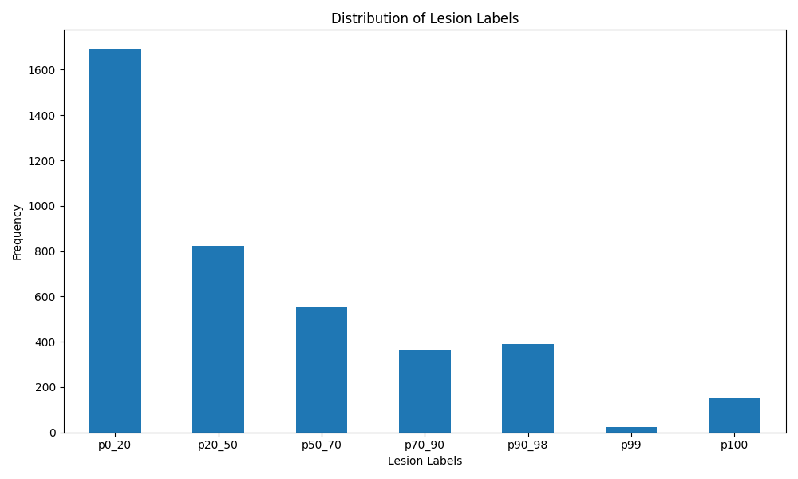
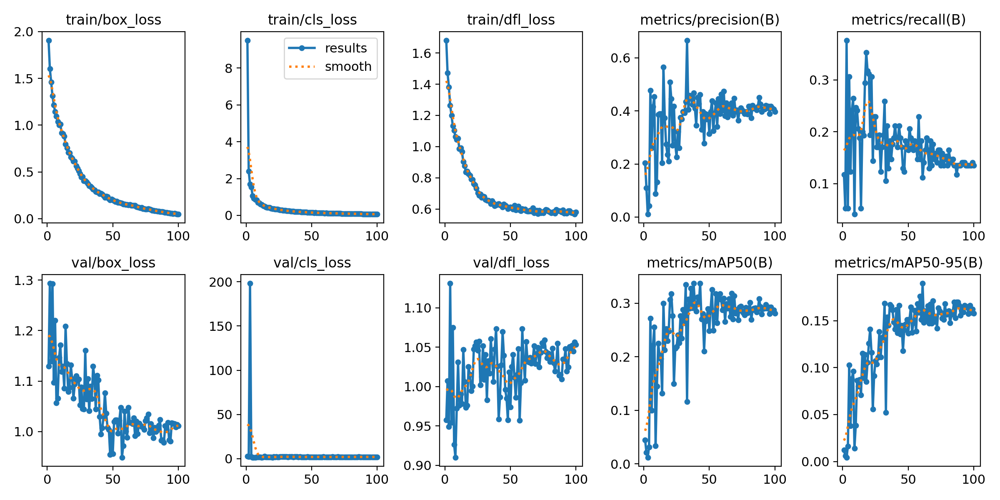
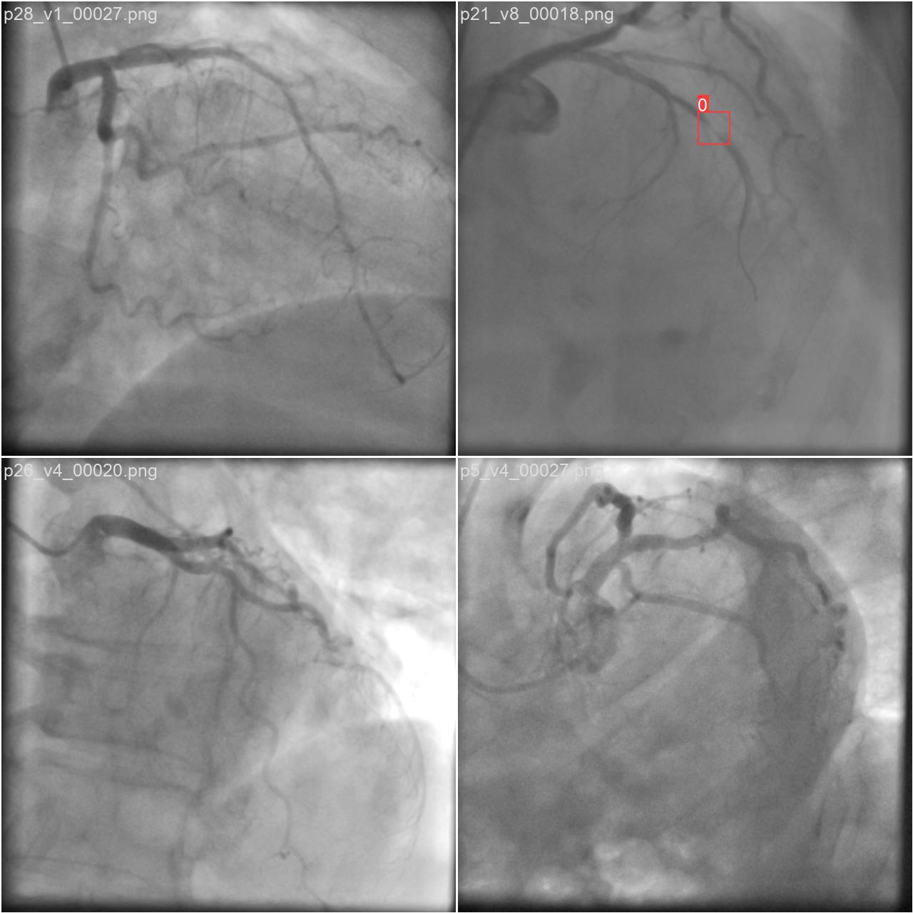
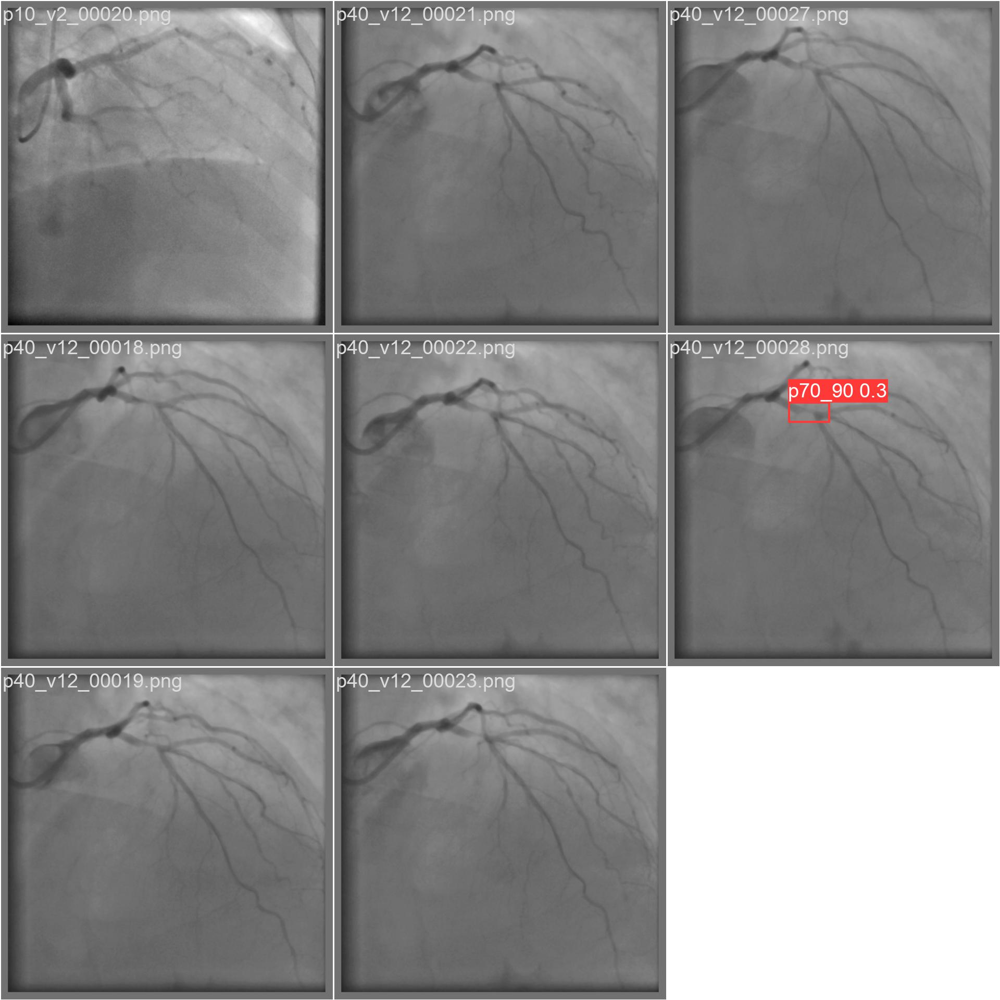
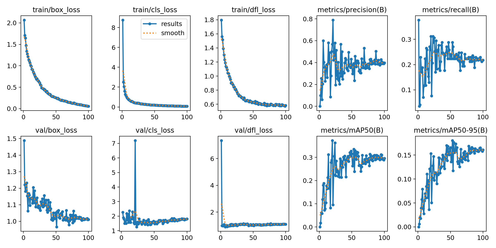
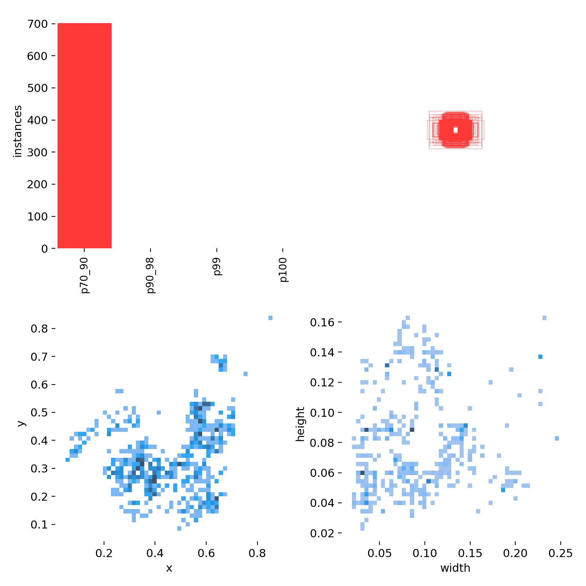
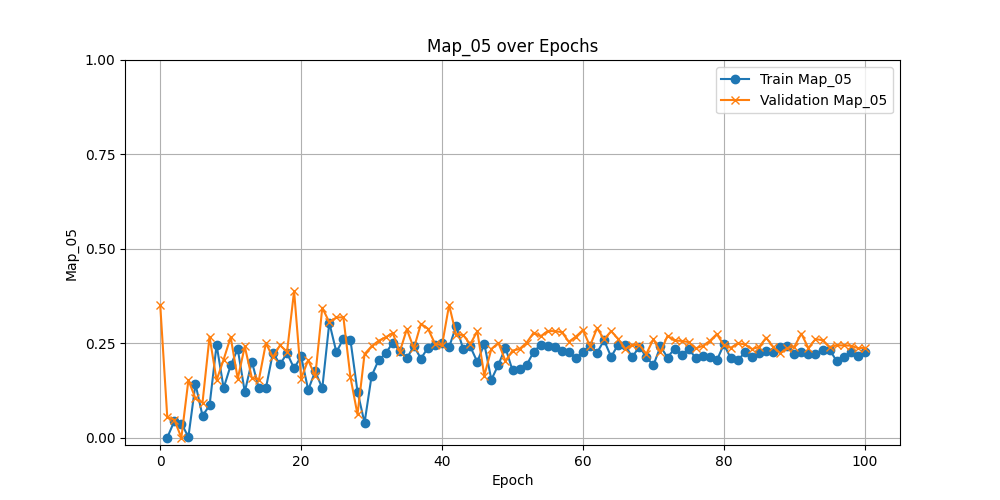
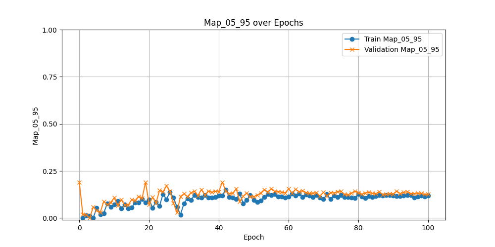

# Progresión Semana 1: 17/06 - 21/06

## Exploración Dataset

- Se ha descargado el conjunto de datos CADICA.
- Se ha realizado un análisis exploratorio del conjunto de datos, este análisis de datos exploratorio ha incluído inspeccionar:
    1. Cantidad de Videos por paciente
    2. Cantidad de Frames con Lesión por paciente
    3. Cantidad de Frames por tipo de Lesión por paciente (p0_20, p20_50, ... p100)



## Conjunto de Datos

- Se ha programado una función para realizar un HoldOut al conjunto de datos. Se ha realizado la división por video, no por paciente,
  esto significa que un paciente puede tener sus videos en diferentes splits, pero los frames de un mismo video siempre terminarán en
  un mismo split.
- El HoldOut se ha realizado un esquema de train/val/test (60%, 20%, 20%).
- Se ha realizado una conversión del conjunto de datos al formato esperado por la detección de YOLOv8, esto incluye:
    1. Creación de dos carpetas, "images" y "labels".
    2. Cada carpeta tendrá los 3 splits (train, test, val).
    3. La carpeta labels tendrá un archivo .txt por cada frame con lesión, dejando los frames sin lesión sin ningún archivo .txt
    4. Se ha realizado una conversión del formato "[x,y,w,h], where (x,y) are the pixel coordinates of the top left corner, w is
    the width and h is the height of the bounding box." al formato esperado por YOLO, el cual consiste en encontrar el punto central
    de la bounding box, y especificarlo junto con la distancia a cada lado normalizada.


## Entrenamiento y Validación YOLOv8

- Se ha creado una primera versión de la clase encargada del entrenamiento de la red YOLOv8 para la detección de ateroesclerosis en las
  imágenes.
    1. Se han seleccionado solo las imágenes con lesiones de grados: p70_90, p90_98, p99, y p100
    2. El fichero `.yaml` de configuración de la red se ha configurado para que utilice todos los labels disponibles en el conjunto de datos, sin embargo, parece que no es buena idea hacerlo sin tener el resto de clases. Esto se debe a que el modelo parece administrar un orden de prioridad a las etiquetas al tener una codificación numérica nominal, haciendo que si duda, lo ponga en la clasificación más baja (0: p0_20). Por lo tanto, para este primer entrenamiento, **solo se incluirán las etiquetas p70_90 - p100** en el fichero yaml. 

```yaml
path: .Baseline_CADICA_Detection
train: images/train  
val: images/val  
test:  images/test

names:
  0: p0_20
  1: p20_50
  2: p50_70
  3: p70_90
  4: p90_98
  5: p99
  6: p100
```



La imgen superior contiene los resultados del entrenamiento realizado con el fichero yaml adjuntado. Como se puede observar los resultados de precisión pueden ser buenos, lo que denota una capacidad notable del modelo para detectar la lesión, sin embargo, el recall es bajo, indicando que el modelo no clasifica bien una lesión cuando la detecta



La imagen superior muestra una visualización de los labels predecidos de uno de los batch de entrenamiento. No hay imágenes con p0_20 en el conjunto de datos, lo que indica que el modelo no clasifica bien las lesiones.

- Se ha realizado un entrenamiento con un fichero `.yaml` con el formato adjunto inferiormente, como se puede observar, sin incluir las etiquetas con las que no se va a evaluar el modelo.

```yaml
path: .Baseline_CADICA_Detection
train: images/train  
val: images/val  
test:  images/test

names:
  0: p70_90
  1: p90_98
  2: p99
  3: p100
```

Los resultados de este entrenamiento son los siguientes:







Como se puede observar, la precisión y el recall han aumentado, sin embargo, el modelo parece tener problemas detectando las lesiones con menos muestras, ya que solo ha clasificado las lesiones p70_90, que, como se puede observar según la gráfica dada por el modelo, es el único tipo de lesiones que se han podido detectar.

Si bien la detección ha mejorado, el siguiente paso sería aplicar un algoritmo de aumentación de datos a las clases minoritarias para balancearlas todas, todo sin que la cantidad de muestras totales de frames con lesión supere a las de frames sin lesión.

## Resultados






Como se puede observar en las gráficas anteriores, la precisión es la medida más alta, lo cual indica que el modelo ha detectado correctamente las lesiones. Sin embargo, un Recall bajo, y teniendo en cuenta las distribución de predicción de labels comentada anteriormente, indica que hay un desbalance de clases demasiado notable en el conjunto de entrenamiento, haciendo que el modelo clasifique incorrectamente las lesiones en las diferentes clases dadas.

Estas dos observaciones se ven reflejadas en el `map`. 

## Propuestas para la semana 2

1. Realizar una aumentación de datos de tal forma que el modelo se entrene con la misma cantidad de instancias de cada clase. 
2. Asegurar que la aumentación de datos no desbalancea el equilibrio imagen sin lesion/imagen con lesion, para no afectar a la precisión. 
3. Aumentaciones propuestas:
   1. Variación de contraste
   2. Variación de brillo
   3. Rotación de imágenes (Con cuidado de rotar la bounding box)
   4. Translación de imágenes (Bounding box)
