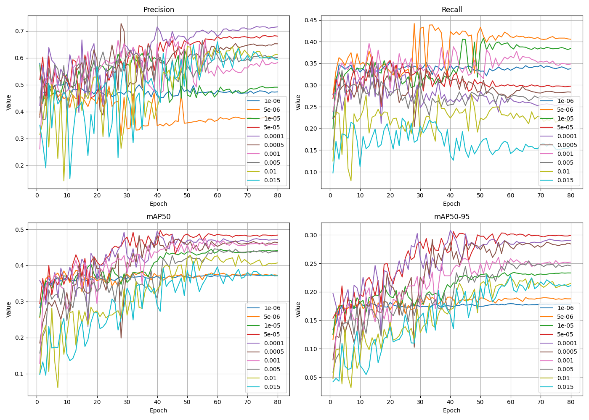
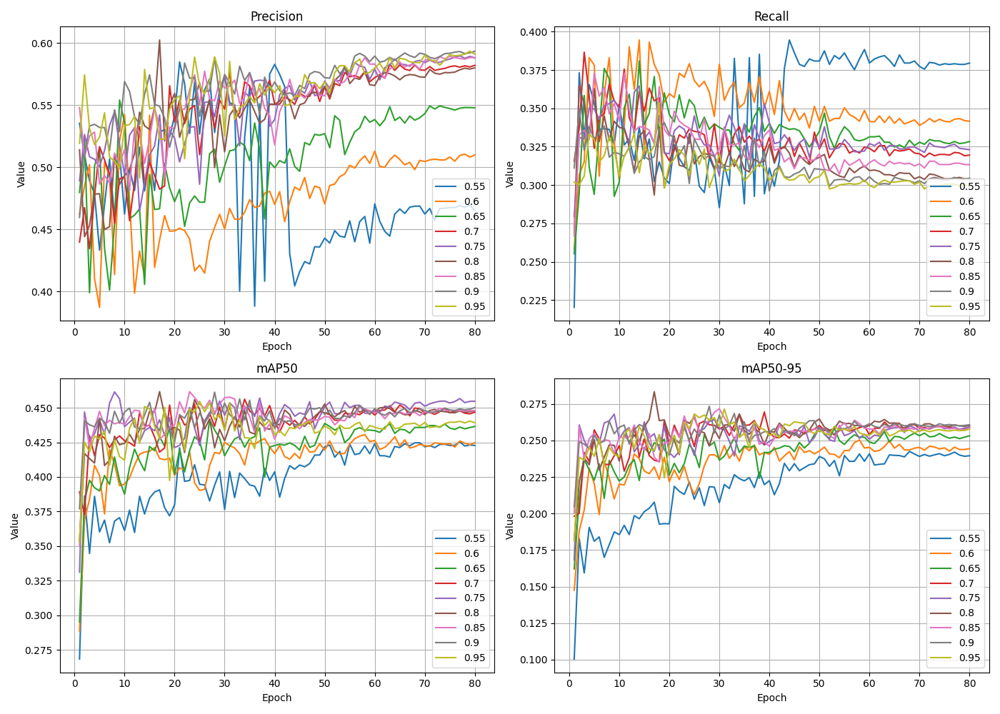

# Progresión Semanas 11 y 12: 02-06 / 09-13

## Objetivos

- [ ] Evaluar los resultados de la implementación de un **Ajuste de Hyperparámetros Bayesiano** (*Bayesian Hyperparameter Optimization*).
- [ ] Evaluar resultados de ajuste de hiperparámetros manual.

## Resultados

### Ajuste manual: `lr0`

|   Precision |   Recall |    mAP50 |   mAP50-95 |   Parameter |
|------------:|---------:|---------:|-----------:|------------:|
|    0.396305 | 0.384749 | 0.367743 |   0.181638 |      5e-06  |
|    0.520373 | 0.350653 | 0.402059 |   0.208063 |      1e-05  |
|    0.56418  | 0.345705 | 0.415916 |   0.214841 |      0.001  |
|    0.475538 | 0.336913 | 0.365383 |   0.175146 |      1e-06  |
|    0.606534 | 0.30893  | 0.446849 |   0.263869 |      5e-05  |
|    0.577994 | 0.294082 | 0.408089 |   0.233976 |      0.0005 |
|    0.630998 | 0.274347 | 0.432776 |   0.255887 |      0.0001 |
|    0.563843 | 0.272984 | 0.374687 |   0.198168 |      0.005  |
|    0.511481 | 0.221642 | 0.329961 |   0.164675 |      0.01   |
|    0.497957 | 0.168625 | 0.302524 |   0.159559 |      0.015  |

Como podemos observar, el experimento, que fue ejecutado durante 80 épocas para cada valor de lr0, muestra que el valor más adecuado para mejorar el recall de manera significativa será $5e-6$, dado que obtiene el valor más alto, seguido de $1e-5$. Por el momento, se tomará la media entre estos dos mejores valores como la tasa de aprendizaje actual, para continuar con la experimentación, dado que, cuando se ajusten otros parámetros como el momento del modelo, se ejecutará un algoritmo bayesiano para determinar el valor óptimo exacto entre estos que da el mejor resultado.

### Ajuste manual: `momentum`

|   Precision |   Recall |    mAP50 |   mAP50-95 |   Parameter |
|------------:|---------:|---------:|-----------:|------------:|
|    0.477099 | 0.350012 | 0.414312 |   0.235472 |        0.6  |
|    0.48667  | 0.349722 | 0.399921 |   0.218675 |        0.55 |
|    0.508934 | 0.334251 | 0.422308 |   0.243061 |        0.65 |
|    0.545924 | 0.330627 | 0.439566 |   0.253438 |        0.7  |
|    0.55242  | 0.330438 | 0.444042 |   0.253663 |        0.75 |
|    0.555897 | 0.325232 | 0.442986 |   0.255049 |        0.85 |
|    0.546948 | 0.316251 | 0.438749 |   0.255411 |        0.8  |
|    0.566628 | 0.313018 | 0.44365  |   0.256359 |        0.9  |
|    0.561895 | 0.30886  | 0.434345 |   0.253599 |        0.95 |

El valor más bajo de todos, 0.55, ha obtenido el mejor resultado en Recall, sin embargo, el recall medio más alto ha sido obtenido por el anterior valor probado, 0.6, es por esto que estos valores serán seleccionados para el ajuste bayesiano.