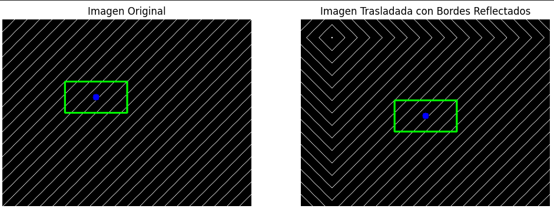
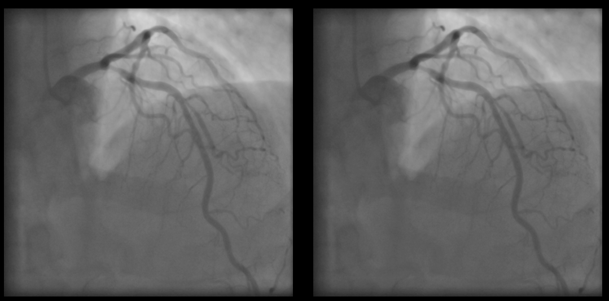
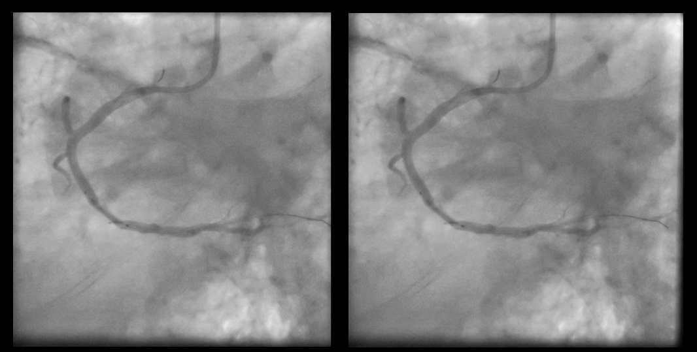
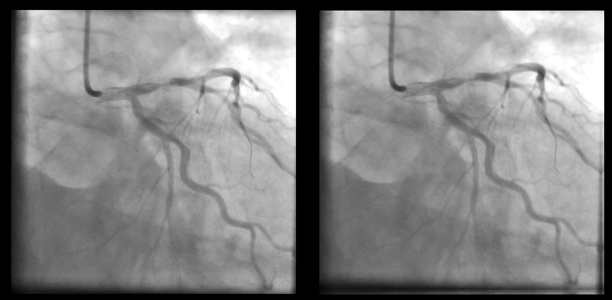
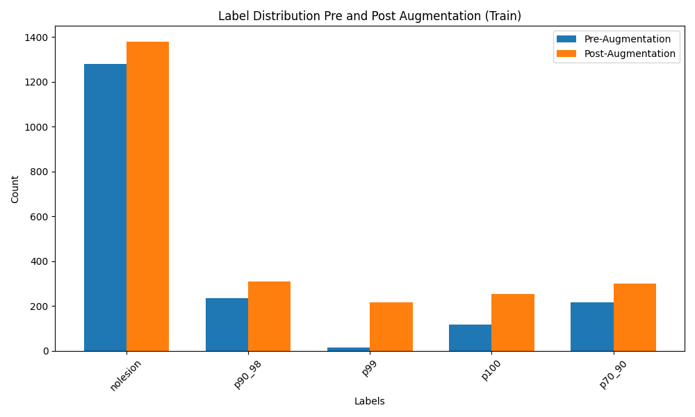

# Progresión Semana 2: 1/07 - 5/07

## Objetivos de la semana

1. Convertir el problema de detección/clasificación de YOLOv8 en un problema de detección únicamente, extrayendo las bounding boxes detectadas a un formato de tensor para poder delimitar la sección que será procesada posteriormente por una red de clasificación. Se propone almacenar en un fichero `csv` los datos deferentes a la etiqueta de la imagen, que irán asociados a la imagen original. 
2. Realizar una aumentación de datos para el problema de detección únicamente, con la finalidad de mejorar la precisión del modelo. Esta aumentación de datos deberá ser aplicada tanto a las imágenes sin lesión como a las de con lesión. Tendrá las siguientes características:
    - Se aumentará un % determinado a datos con lesión y sin lesión, de tal forma que la aumentación de datos esté presente en ambas, pero con una mayor presencia en las imágenes con lesión. 
    - Dentro de las imágenes con lesión, aunque el problema sea méramente de detección, aplicarán de manera indexada las aumentaciones a las diferentes clases, de la forma que la clase con menor instancias sea la más aumentada -asegurando la aumentación en todas. 
    - Las transformaciones serán:
      - Variación ligera del brillo.
      - Variación ligera del contraste.
      - Rotación **muy ligera** de la imagen.
      - Translación **muy ligera** de la imagen. 
3. Investigar sobre redes convolucionales de clasificación o backbones que puedan servir con este propósito. (No diseñarla hasta que el objetivo 2 haya hecho que YOLO mejore su precisión, recall, y mAP). 
4. Documentar el proceso con la finalidad de detectar errores de diseño. 

## Aumentación de datos

- Se ha introducido un factor 2 a 1 la cantidad de imágenes con lesión, para poder tener una mejor representación de la clase minoritaria. 
- Se ha aumentado el brillo y contraste de las imágenes con lesión. Generando nuevos nombres. 
- Una misma imagen puede ser aumentada por veces por el mismo método. Por ello, se ha añadido un número secuencial al nombre. 
- Se ha indexado la cantidad de imágenes con lesión generadas artificialmente por label de tal forma que se beneficia mucho más a las clases con menos instancias que a las con más.
- Se han organizado los resultados en una estructura de ficheros que permite comprobar de manera eficiente alguna fuga de datos indeseada. 
- Se ha comprobado que, debido a la complejidad de la programación y que no tiene demasiado sentido, no se va a optar por incluir las rotaciones como parte de la aumentación de datos. Esto se debe en parte a que, en el caso de las rotaciones, no se podría ajustar con total exactitud la bounding box para que se mantenga paralela a los márgenes de la imagen e incluya en su totalidad la región de interés.
- Se han considerado las translaciones entonces como forma de aumentación de datos, y, dado que puede ser una fuente de variación entre los videos, se ha optado por incluirlas en la aumentación de datos. Para poder solventar el problema de los bordes perdidos a la hora de aplicar la translación se ha decidido aplicar un relleno de bordes más cercanos con `cv2.copyMakeBorder`, técnica que aplica un espejo a los bordes, usada en el paper "U-Net: Convolutional Networks for Biomedical Image Segmentation" de [Ronneberger et al. en 2015](https://arxiv.org/abs/1505.04597). Se puede observar un efecto de la técnica:

- Se consideran las siguientes técnicas de aumentación de datos:
    - **Escalado**: Aumentar o reducir el tamaño de la imagen para simular diferentes distancias de la cámara. (`cv2.resize`)
    - **Adición de ruido**: Añadir ruido a la imagen para simular diferentes condiciones de iluminación. Se puede usar *ruido gaussiano o sal y pimienta*.

- Se dejan ejemplos de las aumentaciones aplicadas:
### **Brillo**

### **Contraste**

### **Translación**

Y este es un ejemplo de cómo quedaría la distribución de labels después de la aumentación de datos:

Como se puede observar, las clases con lesión con menos instancias han sido aumentadas más que las con más. Se han incluído algunas imágenes aumentadas en nolesion para que la red no discrimine las imágenes con lesión por la aumentación de datos. 