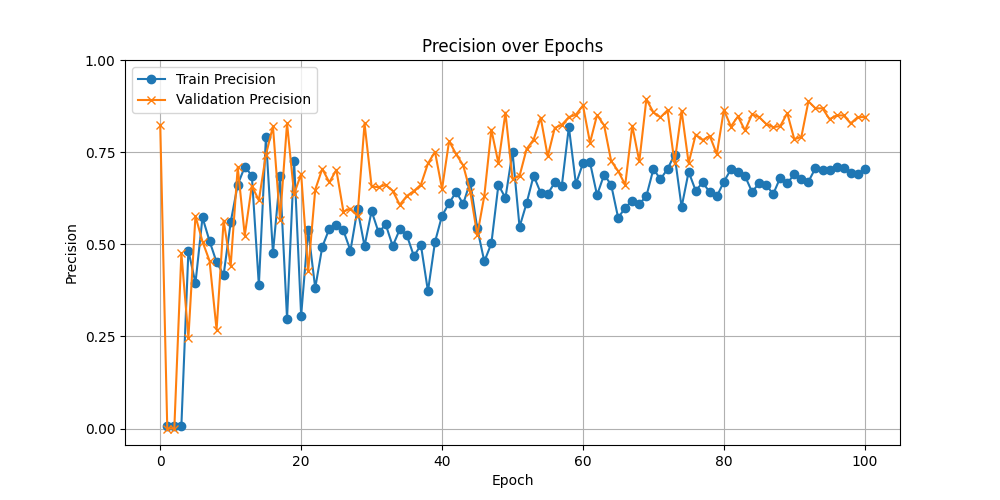
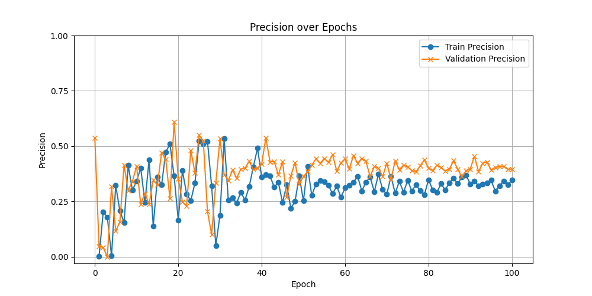
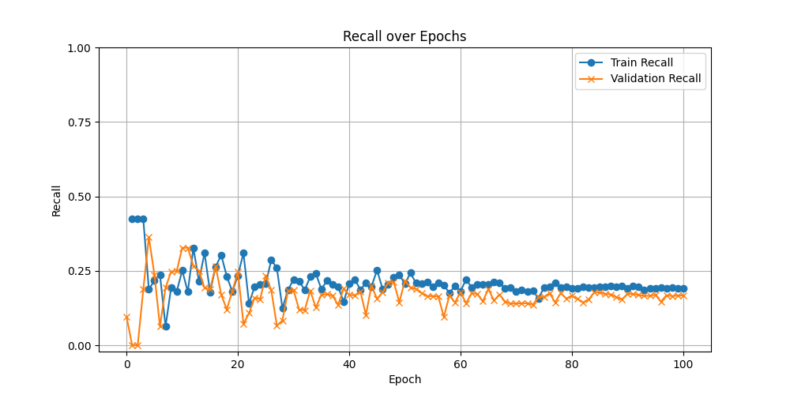
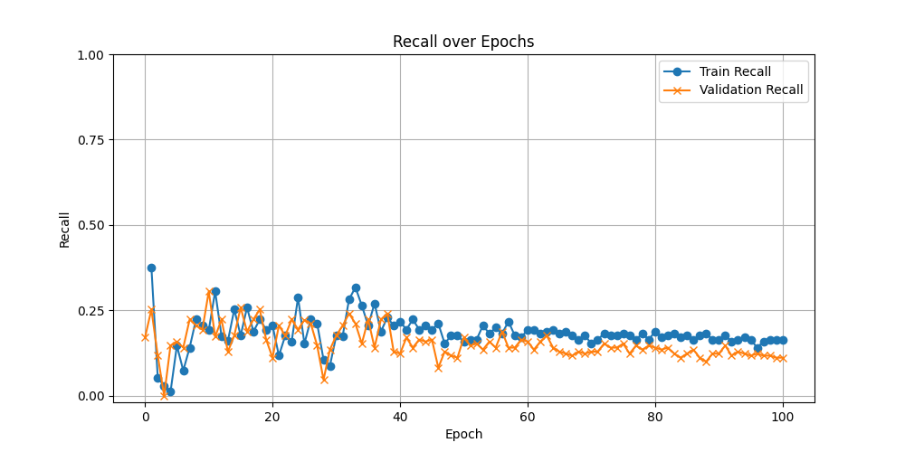
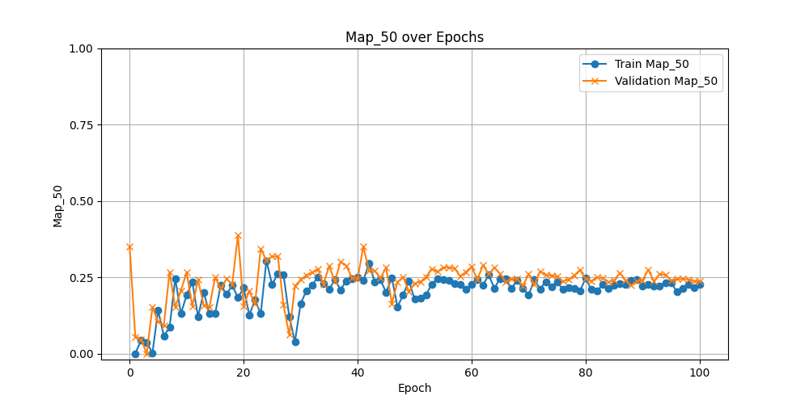
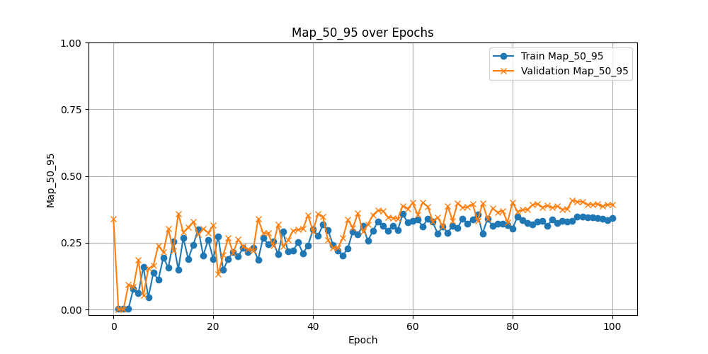
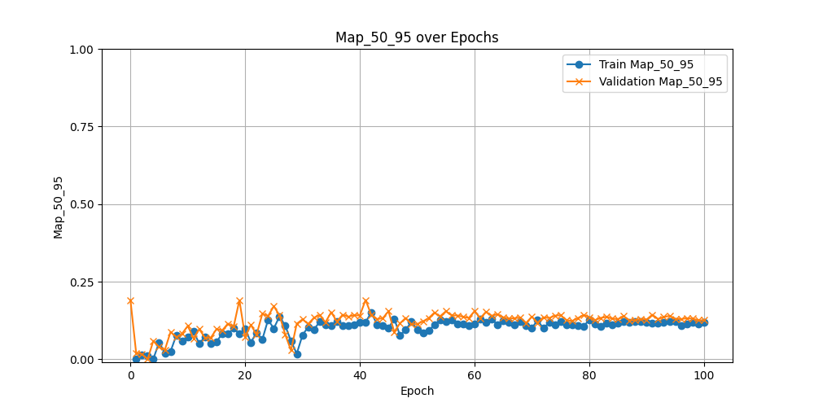

# Progresión Semana 3: 08/07 - 12/07 

# Objetivos de la Semana

1. Realizar entrenamientos con aumentación de datos y analizar los resultados, comparándolos con los resultados de los entrenamientos sin aumentación de datos. 
2. Realizar un ajuste de los hiperparámetros de regularización de YOLOv8, basándose en los resultados de la aumentación de datos. 
3. Investigar sobre redes convolucionales de clasificación o backbones que puedan servir con este propósito. (No diseñarla hasta que el objetivo 2 haya hecho que YOLO mejore su precisión, recall, y mAP). 
4. Documentar el proceso con la finalidad de detectar errores de diseño. 

# Resultados entrenamiento Aumentación

## Precisión

#### Aumentación

#### No-Aumentación

### Interpretación

Como se puede observar, la precisión del modelo ha aumentado de manera gneeral, esto se debe a que la aumentación de datos ha equilibrado las clases, mejorando la generalización del modelo, y haciendo que, de las predicciones positivas del modelo, más sean correctas. 

Esto indica que el modelo ha comprendido mejor la forma de las lesiones. 

## Recall

#### Aumentación

#### No-Aumentación

### Interpretación

La capacidad de clasificar una lesión dentro de una imagen del modelo (recall) no ha mejorado de manera sustancial tanto como la precisión. Muestra una forma muy similar al recall sin aumentación de datos, pero se estabiliza algo más cercano al 0.25

Que el recall no haya aumentado denota que el modelo carece de la capacidad de detectar una lesión dentro de una imagen, significando que los ejemplos dados no son informativos, o que no hay suficientes. 

## mAP@50

#### Aumentación

#### No-Aumentación

### Interpretación
Se observa que tanto el mAP@50 en el conjunto de entrenamiento como en el de validación aumentan rápidamente en las primeras 20 épocas, estabilizándose posteriormente con valores relativamente altos y mostrando menor fluctuación hacia el final del entrenamiento. Esto sugiere que la aumentación de datos contribuye a una mejor generalización y precisión del modelo. En contraste, la gráfica inferior, que representa el entrenamiento sin aumentación, muestra un mAP@50 que también mejora inicialmente, pero con mayores fluctuaciones y alcanzando valores máximos más bajos y menos consistentes. Esto indica que, sin aumentación, el modelo no logra la misma capacidad de generalización y tiene un rendimiento menos robusto.

## mAP@50-95

#### Aumentación

#### No-Aumentación

### Interpretación
La aumentación de datos tiene un impacto positivo en el rendimiento del modelo, ayudando a alcanzar un mayor mAP@50-95 y mejorando la capacidad de generalización. Sin aumentación, el modelo muestra una menor variabilidad pero también un rendimiento más limitado. 

## Resumen

En resumen, las técnicas de aumentación de datos han supuesto una clara ventaja a la hora de entrenar el modelo para la detección, aumentando de promedio todas las métricas, y mostrando mediante la comparación, las áreas en las que el modelo flaquea, que es, principalmente, la detección de la lesión en la imagen (recall), sin embargo, una vez el modelo detecta una lesión, no se equivoca (precisión). El mAP combina la esencia de estos dos anteriores análisis, en concreto, este mAP@50-95 bajo indica que el modelo no tiene una buena capacidad de realizar predicciones precisas y bien localizadas. 

# Ajuste de los hiperparámetros del modelo

Como se ha comentado, se comenzará con el ajuste de los hiperparámetros del modelo. El objetivo de la sección es, bajo un mismo conjunto de datos aumentado, probar diferentes configuraciones de hiperparámetros relacionadas con el optimizador, tasa de aprendizaje, dropout, ... y ver qué configuración de hiperparámetros mejor funciona para el modelo. En el momento en el que se alcance un techo de rendimiento, se podrá proceder con otro tipo de aumentación de datos o técnicas. 

| Hiperparámetro      | Baseline       | Config1                 | Config2 |
|---------------------|----------------|-------------------------|---------|
| `epochs`            | 100            | 100                     | 100     |
| `imgsz`             | 640            | 640                     | 640     |
| `augment`           | False          | False                   | False   |
| `hsv_h`             | 0.0            | 0.0                     | 0.0     |
| `hsv_s`             | 0.0            | 0.0                     | 0.0     |
| `hsv_v`             | 0.0            | 0.0                     | 0.0     |
| `degrees`           | 0.0            | 0.0                     | 0.0     |
| `translate`         | 0.0            | 0.0                     | 0.0     |
| `scale`             | 0.0            | 0.0                     | 0.0     |
| `shear`             | 0.0            | 0.0                     | 0.0     |
| `perspective`       | 0.0            | 0.0                     | 0.0     |
| `flipud`            | 0.0            | 0.0                     | 0.0     |
| `fliplr`            | 0.0            | 0.0                     | 0.0     |
| `mosaic`            | 0.0            | 0.0                     | 0.0     |
| `close_mosaic`      | 0              | 0                       | 0.0     |
| `mixup`             | 0.0            | 0.0                     | 0.0     |
| `copy_paste`        | 0.0            | 0.0                     | 0.0     |
| `auto_augment`      | ""             | ""                      | ""      |
| `erasing`           | 0.0            | 0.0                     | 0.0     |
| `batch`             | 4              | 4                       | 4       |
| `cos_lr`            | -              | True                    | True    |
| `lr0`               | -              | 0.005                   | 0.001   |
| `lrf`               | -              | 0.01                    | 0.01    |  
| `momentum`          | -              | 0.9                     | 0.9     |
| `weight_decay`      | -              | 0.001                   | 0.001   |
| `optimizer`         | -              | `Adam`                  | `Adam`  |
| `warmup_epochs`     | -              | 5.0                     | 5.0     |
| `label_smoothing`   | -              | 0.1                     | 0.1     |
| `dropout`           | -              | 0.1                     | 0.05    |
