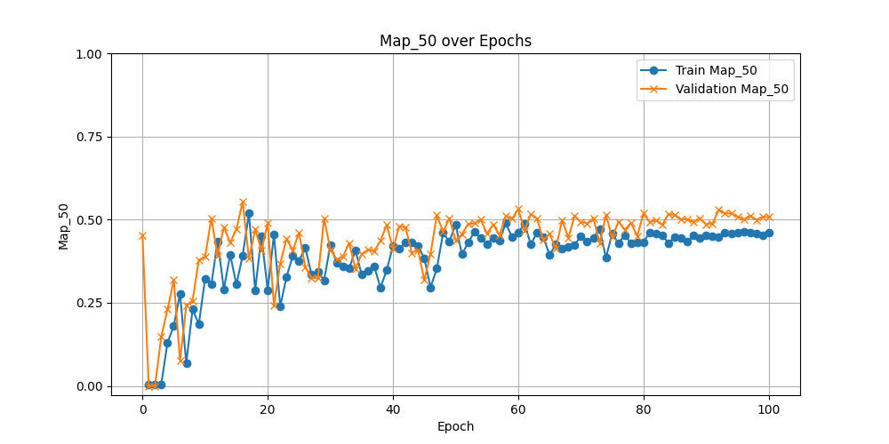
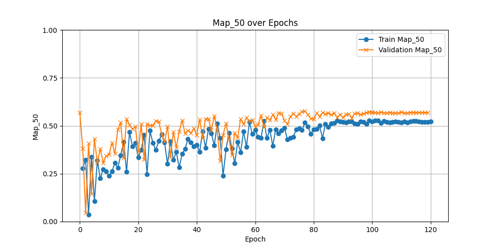
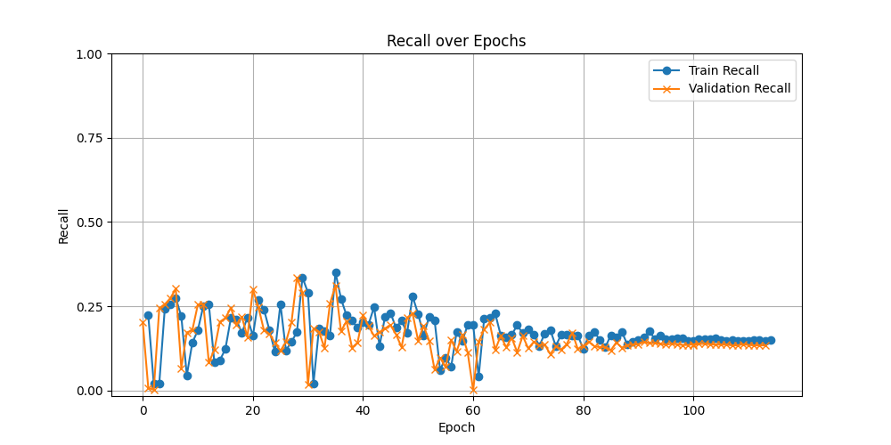

# Progresión Semana 3: 08/07 - 12/07 

# Objetivos de la Semana

1. Realizar entrenamientos con aumentación de datos y analizar los resultados, comparándolos con los resultados de los entrenamientos sin aumentación de datos. 
2. Realizar un ajuste de los hiperparámetros de regularización de YOLOv8, basándose en los resultados de la aumentación de datos. 
3. Investigar sobre redes convolucionales de clasificación o backbones que puedan servir con este propósito. (No diseñarla hasta que el objetivo 2 haya hecho que YOLO mejore su precisión, recall, y mAP). 
4. Documentar el proceso con la finalidad de detectar errores de diseño. 

# Ajuste de los hiperparámetros del modelo

Como se ha comentado, se comenzará con el ajuste de los hiperparámetros del modelo. El objetivo de la sección es, bajo un mismo conjunto de datos aumentado, probar diferentes configuraciones de hiperparámetros relacionadas con el optimizador, tasa de aprendizaje, dropout, ... y ver qué configuración de hiperparámetros mejor funciona para el modelo. En el momento en el que se alcance un techo de rendimiento, se podrá proceder con otro tipo de aumentación de datos o técnicas. 

| Hiperparámetro      | Baseline       | Config1 | Config2 | Config3 |
|---------------------|----------------|---------|---------|---------|
| `epochs`            | 100            | 100     | 100     | 100     |
| `imgsz`             | 640            | 640     | 640     | 640     |
| `augment`           | False          | False   | False   | False   |
| `hsv_h`             | 0.0            | 0.0     | 0.0     | 0.0     |
| `hsv_s`             | 0.0            | 0.0     | 0.0     | 0.0     |
| `hsv_v`             | 0.0            | 0.0     | 0.0     | 0.0     |
| `degrees`           | 0.0            | 0.0     | 0.0     | 0.0     |
| `translate`         | 0.0            | 0.0     | 0.0     | 0.0     |
| `scale`             | 0.0            | 0.0     | 0.0     | 0.0     |
| `shear`             | 0.0            | 0.0     | 0.0     | 0.0     |
| `perspective`       | 0.0            | 0.0     | 0.0     | 0.0     |
| `flipud`            | 0.0            | 0.0     | 0.0     | 0.0     |
| `fliplr`            | 0.0            | 0.0     | 0.0     | 0.0     |
| `mosaic`            | 0.0            | 0.0     | 0.0     | 0.0     |
| `close_mosaic`      | 0              | 0       | 0.0     | 0       |
| `mixup`             | 0.0            | 0.0     | 0.0     | 0.0     |
| `copy_paste`        | 0.0            | 0.0     | 0.0     | 0.0     |
| `auto_augment`      | ""             | ""      | ""      | ""      |
| `erasing`           | 0.0            | 0.0     | 0.0     | 0.0     |
| `batch`             | 4              | 4       | 8       | 8       |
| `cos_lr`            | False          | True    | True    | True    |
| `lr0`               | 0.001          | 0.005   | 0.001   | 0.003   |
| `lrf`               | 0.01           | 0.01    | 0.01    | 0.01    |  
| `momentum`          | 0.937          | 0.9     | 0.9     | 0.9     |
| `weight_decay`      | 0.001          | 0.001   | 0.001   | 0.001   |
| `optimizer`         | Auto           | `Adam`  | `Adam`  | `Adam`  |
| `warmup_epochs`     | 3.0            | 5.0     | 5.0     | 5.0     |
| `label_smoothing`   | 0.0            | 0.1     | 0.1     | 0.2     |
| `dropout`           | 0.0            | 0.1     | 0.05    | 0.001   |
| `cls`               | 0.5            | 0.5     | 0.5     | 1.5     |
| `dfl`               | 2              | 2       | 2       | 1.5     |
| `box`               | 7.5            | 7.5     | 7.5     | 7       |

# Resultados `config1` comparados con baseline 

La comparación de la configuración 1 con la baseline tiene sentido, ya que es la primera configuración que implica una aumentación de datos con el conjunto. 

## Precisión

#### Aumentación

#### No-Aumentación

### Interpretación

Como se puede observar, la precisión del modelo ha aumentado de manera gneeral, esto se debe a que la aumentación de datos ha equilibrado las clases, mejorando la generalización del modelo, y haciendo que, de las predicciones positivas del modelo, más sean correctas. 

Esto indica que el modelo ha comprendido mejor la forma de las lesiones. 

## Recall

#### Aumentación

#### No-Aumentación

### Interpretación

La capacidad de clasificar una lesión dentro de una imagen del modelo (recall) no ha mejorado de manera sustancial tanto como la precisión. Muestra una forma muy similar al recall sin aumentación de datos, pero se estabiliza algo más cercano al 0.25

Que el recall no haya aumentado denota que el modelo carece de la capacidad de detectar una lesión dentro de una imagen, significando que los ejemplos dados no son informativos, o que no hay suficientes. 

## mAP@50

#### Aumentación

#### No-Aumentación

### Interpretación
Se observa que tanto el mAP@50 en el conjunto de entrenamiento como en el de validación aumentan rápidamente en las primeras 20 épocas, estabilizándose posteriormente con valores relativamente altos y mostrando menor fluctuación hacia el final del entrenamiento. Esto sugiere que la aumentación de datos contribuye a una mejor generalización y precisión del modelo. En contraste, la gráfica inferior, que representa el entrenamiento sin aumentación, muestra un mAP@50 que también mejora inicialmente, pero con mayores fluctuaciones y alcanzando valores máximos más bajos y menos consistentes. Esto indica que, sin aumentación, el modelo no logra la misma capacidad de generalización y tiene un rendimiento menos robusto.

## mAP@50-95

#### Aumentación

#### No-Aumentación

### Interpretación
La aumentación de datos tiene un impacto positivo en el rendimiento del modelo, ayudando a alcanzar un mayor mAP@50-95 y mejorando la capacidad de generalización. Sin aumentación, el modelo muestra una menor variabilidad pero también un rendimiento más limitado. 

## Resumen: Aumentación inicial

En resumen, las técnicas de aumentación de datos han supuesto una clara ventaja a la hora de entrenar el modelo para la detección, aumentando de promedio todas las métricas, y mostrando mediante la comparación, las áreas en las que el modelo flaquea, que es, principalmente, la detección de la lesión en la imagen (recall), sin embargo, una vez el modelo detecta una lesión, no se equivoca (precisión). El mAP combina la esencia de estos dos anteriores análisis, en concreto, este mAP@50-95 bajo indica que el modelo no tiene una buena capacidad de realizar predicciones precisas y bien localizadas.

# Resultados `config2`

## Precisión

## Recall

## mAP@50

## mAP@50-95

## Interpretación

Las diferencias entre la configuración 1 y 2 son:
- `lr0` (tasa de aprendizaje inicial): 0.005 -> 0.001
- `dropout` (tasa de conexiones eliminadas): 0.01 -> 0.005
- `batch` (tamaño de bache): 4 -> 8

Como se puede observar, la precisión global aumenta, sin embargo, desde la época 0 hasta la 90, muestra una clara fluctuación en sus valores, indicando que la tasa de aprendizaje no se está regulando bien, o que se están eliminando conexiones importantes, sin embargo, parece que a partir de esas épocas la precisión se estabiliza en valores altos. 

Por otra parte, el recall no parece mejorar sustancialmente con respecto a la primera configuración, alcanzando una estabilidad de manera más pronta que la precisión, y estabilizándose con una pendiente algo negativa a partir de la época 65, aproximadamente. 

Las métricas map@50 y map@50-95 parecen reflejar bien estas tendencias comentadas de la precisión y el recall, sufriendo una etapa de inestabilidad en las primeras 80 épocas, aproximadamente, y estabilizándose a partir de ahí. Parece que map@50 se estabiliza algo por encima de .5, mientras que map@50-95, algo por debajo de .5

# Resultados `config3`

## Nueva aumentación de datos. 

Para tener un tipo de aumentación de datos nuevo, y no basar las nuevas imágenes simplemente en el brillo, contraste, y translación, se ha incluído, con un 10% de probabilidad al generar al conjunto de datos, la aparición de imágenes con ruido gaussiano. Se incluye un ejemplo de este ruido introducido:

La distribución de este nuevo conjunto de datos queda así entonces:

## Precisión

## Recall

## mAP@50

## mAP@50-95

## Interpretación

Las diferencias entre la configuración 2 y 3 son:
- `lr0`: 0.001 -> 0.003
- `label_smoothing` (suaviza las labels más fuertes): 0.1 -> 0.2
- `dropout`: 0.05 -> 0.0001
- `cls` (peso de la pérdida de clasificación, afecta la clasificación de lesiones): 0.5 -> 1.5
- `dfl`: (peso de la distribución de la pérdida focal): 2 -> 1.5
- `box`: (peso de la componente bbox, afectando el énfasis dado a la correcta colocación de la bbox)7.5 -> 7

Como se puede observar, la precisión no alcanza un punto estable hasta la época 100, a partir de la cual parece tener una tendencia ascendente. Esta inestabilidad puede deberse al aumento de la tasa de aprendizaje inicial, que, combinado con el optimizador `Adam` parece impedir que la red aprenda de manera adecuada hasta una época demasiado tardía. 

El recall sufre algunas variaciones con respecto a la configuración 2, llegando a alcanzar valores algo más altos, pero demostrando una inestabilidad evidente, lo cual puede ser el verdadero culpable de alcanzar estos valores. Independientemente, el incremento no es significativo. 

Las métricas map@50 y map@50-95 parecen reflejar bien estas tendencias comentadas de la precisión y el recall, sufriendo una etapa de inestabilidad en las primeras 100 épocas. Se estabilizan alrededor de valores similares a la configuración 2. 

# Conclusión

El principal objetivo entonces **es aumentar el recall intentando afectar lo menos posible a la precisión del modelo, que ya es alta**. Para conseguir este objetivo, teniendo en cuenta las configuraciones aplicadas, se concluye que:
1. Un tamaño de batch de 8 es suficiente, no siendo necesario aumentarlo, y cumple con las limitaciones de la GPU del servidor. 
2. El optimizador Adam parece funcionar bien, sin embargo, se debe mantener una tasa de aprendizaje del orden de E-3/E-4. Esto se probará la próxima semana. 
3. Parece que un aumento de `cls`, manteniendo el valor de `box` mejora el recall sin afectar demasiado a la precisión. Se probará con otras configuraciones. 

# Objetivos para la próxima semana

1. Seguir probando configuraciones para acotar los valores óptimos para el modelo. 
2. Mejorar el recall hasta aproximadamente un 0.3, manteniendo la precisión al 0.75-0.8. El map@50 debe mantenerse en 0.4, y el map@50-95, en 0.25-0.3 