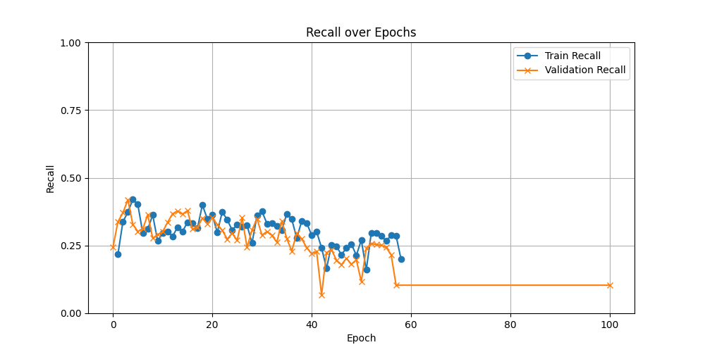
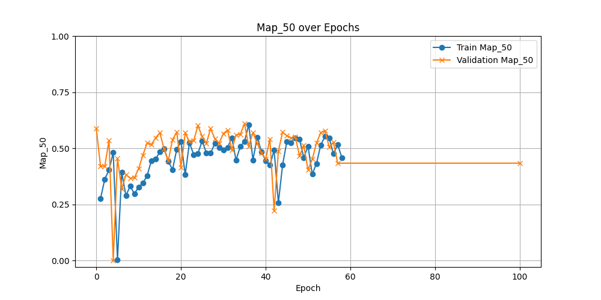
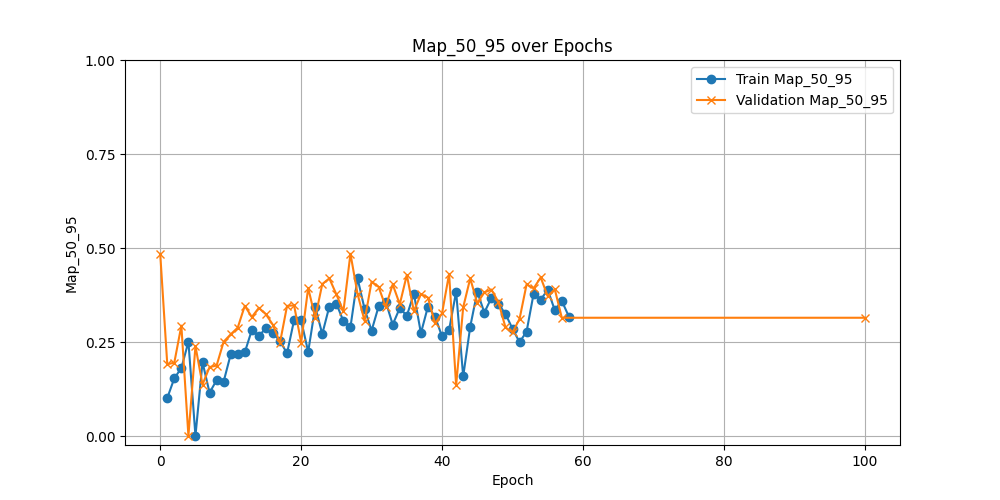
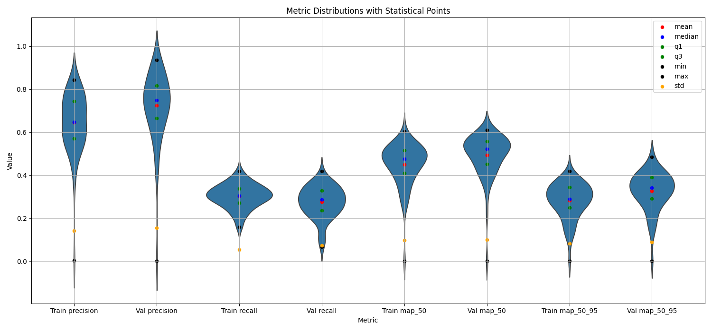

# Progresión Semana 4: 15/07 - 19/07

## Objetivos de la Semana

1. Aumentar el recall de YoloV8 mediante la aplicación de diferentes técnicas de ajuste fino de los parámetros de configuración del modelo. 
2. Mantener la precisión alta, al igual que la anterior semana. 

## Configuraciones Aplicadas hasta el momento. 

| Hiperparámetro      | Baseline       | Config1 | Config2 | Config3 | Config4 | Config5 |
|---------------------|----------------|---------|---------|---------|---------|---------|
| `epochs`            | 100            | 100     | 100     | 100     | 120     | 120     |
| `imgsz`             | 640            | 640     | 640     | 640     | 640     | 1024    |
| `augment`           | False          | False   | False   | False   | False   | False   |
| `hsv_h`             | 0.0            | 0.0     | 0.0     | 0.0     | 0.0     | 0.0     |
| `hsv_s`             | 0.0            | 0.0     | 0.0     | 0.0     | 0.0     | 0.0     |
| `hsv_v`             | 0.0            | 0.0     | 0.0     | 0.0     | 0.0     | 0.0     |
| `degrees`           | 0.0            | 0.0     | 0.0     | 0.0     | 0.0     | 0.0     |
| `translate`         | 0.0            | 0.0     | 0.0     | 0.0     | 0.0     | 0.0     |
| `scale`             | 0.0            | 0.0     | 0.0     | 0.0     | 0.0     | 0.0     |
| `shear`             | 0.0            | 0.0     | 0.0     | 0.0     | 0.0     | 0.0     |
| `perspective`       | 0.0            | 0.0     | 0.0     | 0.0     | 0.0     | 0.0     |
| `flipud`            | 0.0            | 0.0     | 0.0     | 0.0     | 0.0     | 0.0     |
| `fliplr`            | 0.0            | 0.0     | 0.0     | 0.0     | 0.0     | 0.0     |
| `mosaic`            | 0.0            | 0.0     | 0.0     | 0.0     | 0.0     | 0.0     |
| `close_mosaic`      | 0              | 0       | 0       | 0       | 0       | 0       |
| `mixup`             | 0.0            | 0.0     | 0.0     | 0.0     | 0.0     | 0.0     |
| `copy_paste`        | 0.0            | 0.0     | 0.0     | 0.0     | 0.0     | 0.0     |
| `auto_augment`      | ""             | ""      | ""      | ""      | ""      | ""      |
| `erasing`           | 0.0            | 0.0     | 0.0     | 0.0     | 0.0     | 0.0     |
| `batch`             | 4              | 4       | 8       | 8       | 8       | 4       |
| `cos_lr`            | False          | True    | True    | True    | True    | True    |
| `lr0`               | 0.001          | 0.005   | 0.001   | 0.003   | 0.0007  | 0.0007  |
| `lrf`               | 0.01           | 0.01    | 0.01    | 0.01    | 0.01    | 0.01    |  
| `momentum`          | 0.937          | 0.9     | 0.9     | 0.9     | 0.94    | 0.9     |
| `weight_decay`      | 0.001          | 0.001   | 0.001   | 0.001   | 0.001   | 0.001   |
| `optimizer`         | Auto           | `Adam`  | `Adam`  | `Adam`  | `Adam`  | `Adam`  |
| `warmup_epochs`     | 3.0            | 5.0     | 5.0     | 5.0     | 5.0     | 5.0     |
| `label_smoothing`   | 0.0            | 0.1     | 0.1     | 0.2     | 0.01    | 0.01    |
| `dropout`           | 0.0            | 0.1     | 0.05    | 0.001   | 0.001   | 0.001   |
| `cls`               | 0.5            | 0.5     | 0.5     | 1.5     | 2       | 3       |
| `dfl`               | 2              | 2       | 2       | 1.5     | 1       | 1       |
| `box`               | 7.5            | 7.5     | 7.5     | 7       | 7       | 6       |

## Resultados Config4

El entrenamiento realizado con `Config4` se realiza con las siguientes diferencias:
- `lr0`: 0.003 -> 0.0007 
- `momentum`: 0.9 -> 0.94
- `label_smoothing`: 0.2 -> 0.01 
- `cls`: 1.5 -> 2
- `dfl`:  1.5 -> 1

Este entrenamiento se detuvo en la época 60 debido al `early_stopping`, ya que no hubo una mejora sustancial durante las anteriores 30 épocas. Los resultados son los siguientes:

## Precisión

## Recall

## mAP@50

## mAP@50-95

## Estadísticas Config3

| Metric          |   Mean |   Median |     Q1 |     Q3 |    Min |    Max |    Std |
|:----------------|-------:|---------:|-------:|-------:|-------:|-------:|-------:|
| Train precision | 0.6457 |   0.6469 | 0.5713 | 0.7434 | 0.0029 | 0.8437 | 0.1419 |
| Val precision   | 0.7239 |   0.7491 | 0.6657 | 0.8175 | 0.0025 | 0.9349 | 0.1551 |
| Train recall    | 0.3034 |   0.3041 | 0.272  | 0.3373 | 0.1599 | 0.42   | 0.0553 |
| Val recall      | 0.2757 |   0.2872 | 0.237  | 0.3288 | 0.0676 | 0.4189 | 0.0735 |
| Train map_50    | 0.4509 |   0.4772 | 0.4095 | 0.5161 | 0.002  | 0.6045 | 0.098  |
| Val map_50      | 0.4933 |   0.523  | 0.4516 | 0.5576 | 0.0017 | 0.6101 | 0.0999 |
| Train map_50_95 | 0.2827 |   0.2904 | 0.2501 | 0.3444 | 0.0009 | 0.4202 | 0.0826 |
| Val map_50_95   | 0.3269 |   0.3425 | 0.2915 | 0.3902 | 0.0007 | 0.4848 | 0.0886 |

## Interpretación

Como se puede observar, todos los resultados obtenidos, independientemente de la métrica, parecen presentar una inestabilidad notable. Esto se puede deber a que no se ha conseguido mejorar la capacidad de generalización del modelo, o a que el parámetro early stopping ha impedido que el modelo alcance un punto de entrenamiento óptimo.

La métrica de recall, aunque en clara tendencia a disminuir, ha mejorado con respecto a la `Config2`, cosa que podemos atribuir al aumento del parámetro `cls`.

Debido a que YoloV8 **no** cuenta con un hiperparámetro `anchor_box`, al haber sido diseñado anchor-free, se procederá por aumentar el parámetro `imgsz` para verificar si la capacidad de detección de lesiones pequeñas del modelo mejora, pudiendo así detectar más, y aumentando el recall: [How to improve the recall in images #2425](https://github.com/ultralytics/ultralytics/issues/2425).

