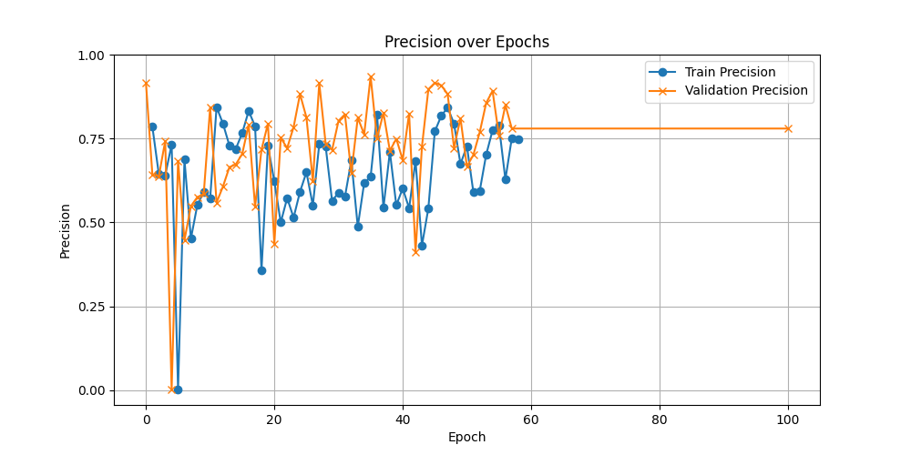

# Progresión Semana 4: 15/07 - 19/07

## Objetivos de la Semana

1. Aumentar el recall de YoloV8 mediante la aplicación de diferentes técnicas de ajuste fino de los parámetros de configuración del modelo. 
2. Probar el efecto de aumentar el parámetro `imgsz` para aumentar el recall, aunque se tenga que disminuir el tamaño de bache. 

## Configuraciones Aplicadas hasta el momento

| Hiperparámetro      | Baseline       | Config1 | Config2 | Config3 | Config4 | Config5 | Config6 |
|---------------------|----------------|---------|---------|---------|---------|---------|--------------|
| `epochs`            | 100            | 100     | 100     | 100     | 120     | 120     | 120          |
| `imgsz`             | 640            | 640     | 640     | 640     | 640     | 1024    | 1280         |
| `augment`           | False          | False   | False   | False   | False   | False   | False        |
| `hsv_h`             | 0.0            | 0.0     | 0.0     | 0.0     | 0.0     | 0.0     | 0.0          |
| `hsv_s`             | 0.0            | 0.0     | 0.0     | 0.0     | 0.0     | 0.0     | 0.0          |
| `hsv_v`             | 0.0            | 0.0     | 0.0     | 0.0     | 0.0     | 0.0     | 0.0          |
| `degrees`           | 0.0            | 0.0     | 0.0     | 0.0     | 0.0     | 0.0     | 0.0          |
| `translate`         | 0.0            | 0.0     | 0.0     | 0.0     | 0.0     | 0.0     | 0.0          |
| `scale`             | 0.0            | 0.0     | 0.0     | 0.0     | 0.0     | 0.0     | 0.0          |
| `shear`             | 0.0            | 0.0     | 0.0     | 0.0     | 0.0     | 0.0     | 0.0          |
| `perspective`       | 0.0            | 0.0     | 0.0     | 0.0     | 0.0     | 0.0     | 0.0          |
| `flipud`            | 0.0            | 0.0     | 0.0     | 0.0     | 0.0     | 0.0     | 0.0          |
| `fliplr`            | 0.0            | 0.0     | 0.0     | 0.0     | 0.0     | 0.0     | 0.0          |
| `mosaic`            | 0.0            | 0.0     | 0.0     | 0.0     | 0.0     | 0.0     | 0.0          |
| `close_mosaic`      | 0              | 0       | 0       | 0       | 0       | 0       | 0            |
| `mixup`             | 0.0            | 0.0     | 0.0     | 0.0     | 0.0     | 0.0     | 0.0          |
| `copy_paste`        | 0.0            | 0.0     | 0.0     | 0.0     | 0.0     | 0.0     | 0.0          |
| `auto_augment`      | ""             | ""      | ""      | ""      | ""      | ""      | ""           |
| `erasing`           | 0.0            | 0.0     | 0.0     | 0.0     | 0.0     | 0.0     | 0.0          |
| `batch`             | 4              | 4       | 8       | 8       | 8       | 4       | 2            |
| `cos_lr`            | False          | True    | True    | True    | True    | True    | True         |
| `lr0`               | 0.001          | 0.005   | 0.001   | 0.003   | 0.0007  | 0.0007  | 0.0007       |
| `lrf`               | 0.01           | 0.01    | 0.01    | 0.01    | 0.01    | 0.01    | 0.01         |
| `momentum`          | 0.937          | 0.9     | 0.9     | 0.9     | 0.94    | 0.9     | 0.9          |
| `weight_decay`      | 0.001          | 0.001   | 0.001   | 0.001   | 0.001   | 0.001   | 0.001        |
| `optimizer`         | Auto           | `Adam`  | `Adam`  | `Adam`  | `Adam`  | `Adam`  | `Adam`       |
| `warmup_epochs`     | 3.0            | 5.0     | 5.0     | 5.0     | 5.0     | 5.0     | 5.0          |
| `label_smoothing`   | 0.0            | 0.1     | 0.1     | 0.2     | 0.01    | 0.01    | 0.01         |
| `dropout`           | 0.0            | 0.1     | 0.05    | 0.001   | 0.001   | 0.001   | 0.001        |
| `cls`               | 0.5            | 0.5     | 0.5     | 1.5     | 2       | 3       | 3            |
| `dfl`               | 2              | 2       | 2       | 1.5     | 1       | 1       | 1            |
| `box`               | 7.5            | 7.5     | 7.5     | 7       | 7       | 6       | 6            |

## Resultados Config4

El entrenamiento realizado con `Config4` se realiza con las siguientes diferencias:
- `lr0`: 0.003 -> 0.0007 
- `momentum`: 0.9 -> 0.94
- `label_smoothing`: 0.2 -> 0.01 
- `cls`: 1.5 -> 2
- `dfl`:  1.5 -> 1

Este entrenamiento se detuvo en la época 60 debido al `early_stopping`, ya que no hubo una mejora sustancial durante las anteriores 30 épocas. Los resultados son los siguientes:

## Precisión

## Recall

## mAP@50

## mAP@50-95

## Estadísticas Config3

| Metric          |   Mean |   Median |     Q1 |     Q3 |    Min |    Max |    Std |
|:----------------|-------:|---------:|-------:|-------:|-------:|-------:|-------:|
| Train precision | 0.6457 |   0.6469 | 0.5713 | 0.7434 | 0.0029 | 0.8437 | 0.1419 |
| Val precision   | 0.7239 |   0.7491 | 0.6657 | 0.8175 | 0.0025 | 0.9349 | 0.1551 |
| Train recall    | 0.3034 |   0.3041 | 0.272  | 0.3373 | 0.1599 | 0.42   | 0.0553 |
| Val recall      | 0.2757 |   0.2872 | 0.237  | 0.3288 | 0.0676 | 0.4189 | 0.0735 |
| Train map_50    | 0.4509 |   0.4772 | 0.4095 | 0.5161 | 0.002  | 0.6045 | 0.098  |
| Val map_50      | 0.4933 |   0.523  | 0.4516 | 0.5576 | 0.0017 | 0.6101 | 0.0999 |
| Train map_50_95 | 0.2827 |   0.2904 | 0.2501 | 0.3444 | 0.0009 | 0.4202 | 0.0826 |
| Val map_50_95   | 0.3269 |   0.3425 | 0.2915 | 0.3902 | 0.0007 | 0.4848 | 0.0886 |

## Interpretación

Como se puede observar, todos los resultados obtenidos, independientemente de la métrica, parecen presentar una inestabilidad notable. Esto se puede deber a que no se ha conseguido mejorar la capacidad de generalización del modelo, o a que el parámetro early stopping ha impedido que el modelo alcance un punto de entrenamiento óptimo.

La métrica de recall, aunque en clara tendencia a disminuir, ha mejorado con respecto a la `Config2`, cosa que podemos atribuir al aumento del parámetro `cls`.

Debido a que YoloV8 **no** cuenta con un hiperparámetro `anchor_box`, al haber sido diseñado anchor-free, se procederá por aumentar el parámetro `imgsz` para verificar si la capacidad de detección de lesiones pequeñas del modelo mejora, pudiendo así detectar más, y aumentando el recall: [How to improve the recall in images #2425](https://github.com/ultralytics/ultralytics/issues/2425).

# Resultados Config5

Este entrenamiento se ha realizado con las siguientes diferencias con respecto a `Config4`:

- `imgsz`: 640 -> 1024
- `cls`: 2 -> 3
- `box`:  7 -> 6
- `batch`: 8 -> 4
- `momentum`: 0.94 -> 0.9

## Precisión

## Recall

## mAP@50

## mAP@50-95

## Estadísticas Config5

| Metric          |   Mean |   Median |     Q1 |     Q3 |    Min |    Max |    Std |
|:----------------|-------:|---------:|-------:|-------:|-------:|-------:|-------:|
| Train precision | 0.6679 |   0.7008 | 0.6198 | 0.7418 | 0.2774 | 0.9062 | 0.1126 |
| Val precision   | 0.3535 |   0.3333 | 0.2091 | 0.422  | 0      | 0.9831 | 0.2295 |
| Train recall    | 0.241  |   0.2376 | 0.2004 | 0.2714 | 0.1532 | 0.4155 | 0.0484 |
| Val recall      | 0.0147 |   0.0023 | 0.0011 | 0.0073 | 0      | 0.1498 | 0.0305 |
| Train map_50    | 0.4358 |   0.4524 | 0.4007 | 0.4839 | 0.2034 | 0.5464 | 0.0689 |
| Val map_50      | 0.1464 |   0.1276 | 0.0803 | 0.2004 | 0      | 0.4057 | 0.0923 |
| Train map_50_95 | 0.277  |   0.2997 | 0.2425 | 0.316  | 0.0885 | 0.3703 | 0.057  |
| Val map_50_95   | 0.0695 |   0.0638 | 0.0416 | 0.0795 | 0      | 0.2624 | 0.0468 |

## Interpretación

Como se puede observar, los resultados obtenidos han empeorado con respecto a `Config4`, mostrando tanto un valor medio más bajo, como una inestabilidad más notable. Esto puede deberse a haber disminuído el tamaño de bache del entrenamiento, creando mayores fluctuaciones en las métricas. 

Se probará finalmente a aumentar el tamaño de `imgsz` una vez más, manteniendo el valor del resto de hiperparámetros, para, finalmente, incidir si el aumento de `imgsz` ha mejorado el recall del modelo. 

# Resultados Config6

Este entrenamiento se ha realizado con las siguientes diferencias con respecto a `Config5`:

- `imgsz`: 1024 -> 1280
- `batch`: 4 -> 2

## Precisión

## Recall

## mAP@50

## mAP@50-95

## Estadísticas Config6

| Metric          |   Mean |   Median |     Q1 |     Q3 |    Min |    Max |    Std |
|:----------------|-------:|---------:|-------:|-------:|-------:|-------:|-------:|
| Train precision | 0.6715 |   0.7075 | 0.6364 | 0.7253 | 0.1861 | 0.9147 | 0.1154 |
| Val precision   | 0.6321 |   0.75   | 0.5    | 0.817  | 0      | 1      | 0.2996 |
| Train recall    | 0.2196 |   0.1886 | 0.1824 | 0.2548 | 0.0822 | 0.4437 | 0.0563 |
| Val recall      | 0.0052 |   0.0034 | 0.0034 | 0.0045 | 0      | 0.0777 | 0.0092 |
| Train map_50    | 0.4296 |   0.4572 | 0.4021 | 0.4691 | 0.1045 | 0.5447 | 0.0705 |
| Val map_50      | 0.2918 |   0.3606 | 0.2034 | 0.3775 | 0      | 0.5034 | 0.1455 |
| Train map_50_95 | 0.2753 |   0.3041 | 0.2484 | 0.3185 | 0.05   | 0.3641 | 0.0636 |
| Val map_50_95   | 0.1247 |   0.139  | 0.0872 | 0.1639 | 0      | 0.3504 | 0.0654 |

## Interpretación

Como se puede observar, el recall ha tenido una mejora durante el entrenamiento, pero en validación esta mejora se ha visto totalmente revertida. Al aumentar el tamaño de la imagen, es probable que el modelo haya podido aprender a detectar más objetos, sin embargo, el reducido tamaño de bache, la baja tasa de aprendizaje, y el momento reducido con respecto a la base para el optimizador `Adam` han hecho que el modelo no haya podido aprender a detectar los objetos, introduciendo además una inestabilidad notable en el entrenamiento. 

## Conclusión de esta semana y objetivos futuros

- Se ha conseguido comprender mejor el efecto de cada hiperparámetro en el recall del modelo, pudiendo acotar unos valores que parecen ser beneficiosos con este fin. 
- Se ha conseguido mantener la precisión del modelo, sin embargo, no ha habido mejoras significativas para el recall.

Para la siguiente semana, **se probará a ejecutar un Algoritmo Genético (GA) para el ajuste de hiperparámetros de YOLOv8**, esta implementación del algoritmo genético viene ya dada por ultralytics, y esta serie de pruebas que se han realizado durante esta semana habrán sentado las bases para inicialización de hiperparámetros del algoritmo, pudiendo además ignorar los hiperparámetros que no se han visto afectar significativamente en el recall del modelo.