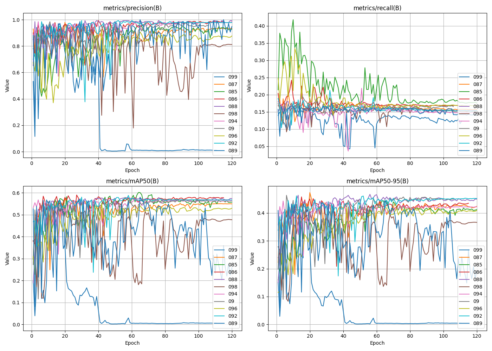

# Progresión Semana 5/6: 22/07 - 2/08

## Objetivos de la semana

- [X] Realizar el ajuste fino de dos hiperparámetros de la red, comprobando y analizando el impacto de la variación de estos en el rendimiento de la red entrenando el modelo con diferentes valores de estos.
- [X] Investigar cómo se puede ejecutar el Algoritmo Genético de Ultralytics en el supercomputador Picasso con la finalidad de encontrar un resultado alternativo al ajuste de hiperparámetros manual que se está realizando.

## Resultados

### Ajuste manual de la Tasa de Aprendizaje Inicial, `lr0`

Como se puede observar, una tasa de aprendizaje baja, como `lr0=0.0001` parece ayudar a la generalización del modelo, dando unos valores de Precisión y Recall altos, y alcanzando el valor más alto de las métricas `mAP50` y `mAP50-95`.

Otras tasas de aprendizaje alternativas como `lr0=0.01` y `lr0=0.0005`, algo más elevadas que la anterior, parecen dar unas métricas similares, pero menos competitivas en el marco general.

Se ha determinado entonces que se procederá con una tasa de aprendizaje inicial `lr0=0.0001`.

### Ajuste manual del momento `momentum`

En el comienzo del experimento con los diferentes momentos para el optimizador se determinaron los valores de prueba `[0.85, 0.9, 0.92, 0.94, 0.96, 0.98, 0.99]`, sin embargo, dado que el valor con un recall final más alto fue 0.85, y había 5 centésimas de diferencia con el siguiente valor probado, se decidió gastar un día más en añadir al experimento valores entre el 0.85 y el 0.9, resultando en los datos expuestos en la imagen superior.

Como se puede observar entonces, con una tasa de aprendizaje inicial de `lr0=0.0001`, el momento óptimo para la red es `momentum=0.85`, con un valor de Recall final más alto que los demás momentos probados.

### Algoritmo Genético en Picasso

Se sigue investigando cómo poder ejercutar el GA del paquete Ultralytics en el SC Picasso, se ha contactado con los administradores para proporcionar soporte dado que no se ha conseguido hacer funcionar el paquete ultralytics en un entorno conda dentro de los nodos de cómputo.

## Conclusiones

Durante esta semana, se ha determinado que la tasa de aprendizaje inicial `lr0=0.0001` es el valor óptimo para la red, y que el momento `momentum=0.85` es el mejor momento para este valor de aprendizaje inicial. Habría que investigar, una vez se han explorado los parámetros que pueden afectar al rendimiento del recall de manera individual, cómo pueden actuar estos parámetros en combinación con otros, y no de manera individual. La próxima semana se dedicará a determinar los valores óptimos de los parámetros `lrf`, `imgsz`, y `batch`, teniendo en cuenta que `imgsz` y `batch` cuentan con la restricción de la memoria de video de la GPU.
