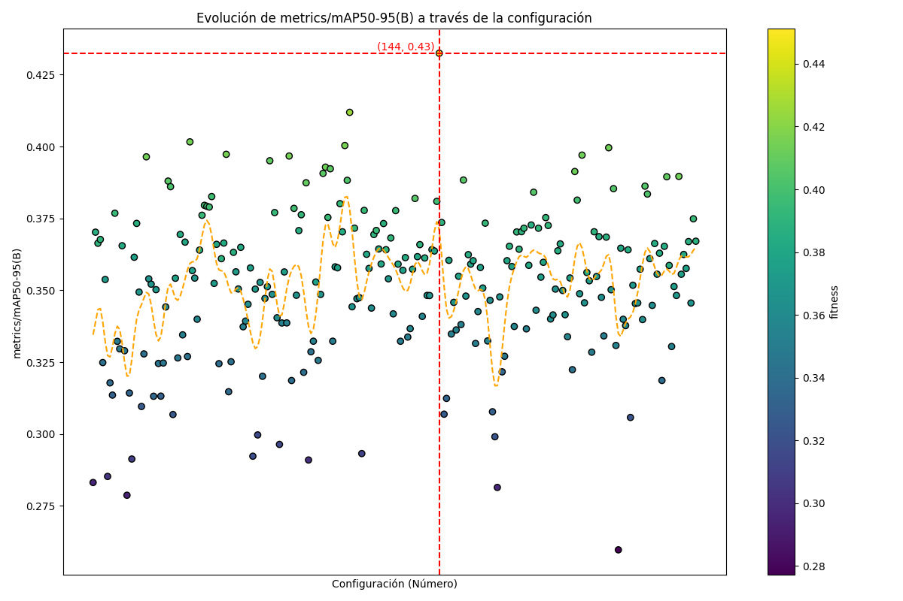
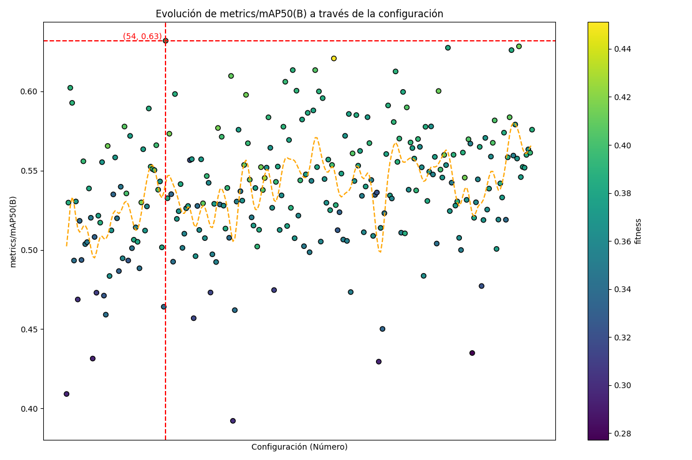
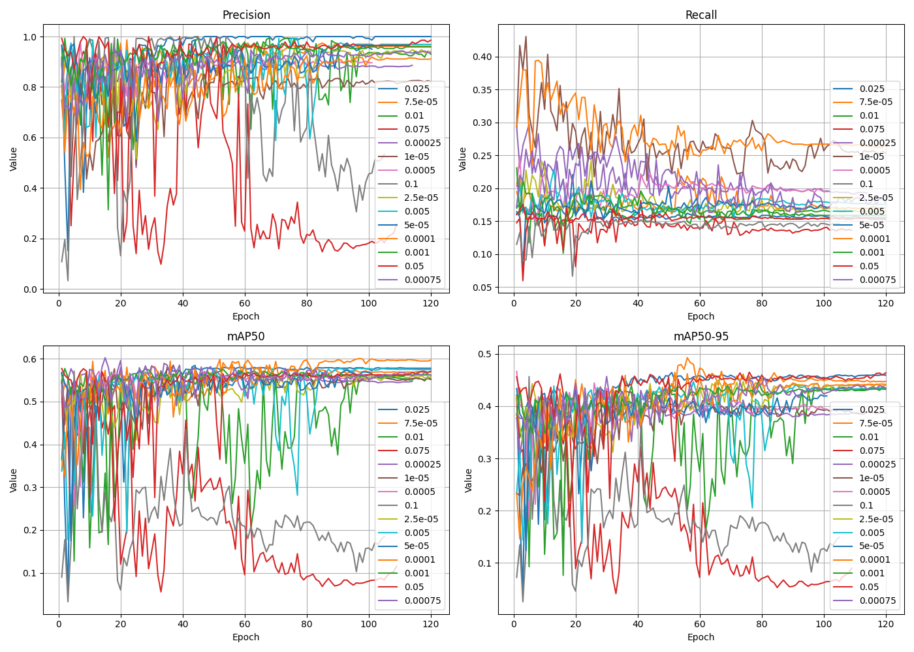

# Progresión Semana 7: 5/08 - 9/08 

## Objetivos

- [X] Ejecución del Algoritmo Genético en Picasso, análisis de resultados.
- [X] Ajuste fino de hiperparámetros `momentum` y final learning rate `lrf`.
- [X] Análisis comparativo de resultados.
- [X] Entrenamiento del modelo con todas las clases.

## Resultados

### Algoritmo Genético

El Algoritmo Genético se ha podido ejecutar en el supercomputador Picasso. Para ello, se ha creado un entorno conda y se han instalado las dependencias del script que contiene la ejecución de este. Acto seguido, se ha enviado el siguiente trabajo:

```bash
#!/usr/bin/env bash
#SBATCH --job-name=yolov8_tuning
#SBATCH --time=2-00:00:00
#SBATCH --mem=100G
#SBATCH --ntasks=1
#SBATCH --cpus-per-task=16
#SBATCH --gres=gpu:1
#SBATCH --constraint=dgx
#SBATCH --error=yolov8_tuning.%J.err
#SBATCH --output=yolov8_tuning.%J.out

# Activar el entorno Conda
conda activate yolov8_env

# Ejecutar el script de Python
python /mnt/home/users/tic_163_uma/mpascual/GA_Ultralytics/yolov8.py

# Desactivar el entorno
conda deactivate
```

Los resultados de ejecutar el algoritmo genético durante 250 iteraciones a 30 épocas por iteración priorizando la configuración inicial de Ultralytics como función de fitness (.9 de paso a mAP50-95 y .1 de paso a mAP50) son los siguientes:





Con la siguiente variación de hiperparámetros:


Siendo los mejores hiperparámetros encontrados:

```yaml
# 250/250 iterations complete ✅ (199059.74s)
# Results saved to runs/detect/tune
# Best fitness=0.45127 observed at iteration 144
# Best fitness metrics are 
#{'metrics/precision(B)': 0.80378, 
#'metrics/recall(B)': 0.38288, 
#'metrics/mAP50(B)': 0.62075, 
#'metrics/mAP50-95(B)': 0.43244, 
#'val/box_loss': 1.39211, 
#'val/cls_loss': 3.70387, 
#'val/dfl_loss': 1.40281, 
#'fitness': 0.45127}
# Best fitness model is runs/detect/ateroesclerosis_tuning144
# Best fitness hyperparameters are printed below.

lr0: 9.0e-05
lrf: 0.00598
momentum: 0.7
weight_decay: 0.00058
warmup_epochs: 4.17161
warmup_momentum: 0.54512
box: 6.58368
cls: 0.61893
dfl: 1.41746
```

Como se puede observar en los scatter plots de los hiperparámetros, hay indicios de que los hiperparámetros iniciales introducidos al algoritmo no han sido los más beneficiosos para el entrenamiento se este. Esto se debe a que, donde la mayoría de valores residen (puntos amarillos) el algoritmo no ha encontrado el valor con mejor fitness dentro de estas regiones.

Dado que la verdadera búsqueda que se está realizando es la de encontrar la combinación de hiperparámetros con un mejor recall sin perder una alta precisión, se procederá a modificar la función de fitness para darle más peso a la métrica de recall, utilizándome como **hiperparámetros iniciales los encontrados en la iteración 54**, que son los que han dado lugar a un recall de 0.5 en 30 iteraciones.

```yaml
seed: 42
deterministic: true
single_cls: true
cos_lr: false
conf: null
iou: 0.7
max_det: 300
lr0: 8.0e-05
lrf: 0.00598
momentum: 0.7
weight_decay: 0.00045
warmup_epochs: 3.55158
warmup_momentum: 0.54424
warmup_bias_lr: 0.1
box: 6.7212
cls: 0.49345
dfl: 1.30573
```

De manera paralela, se comprobará si este valor de recall con los hiperparámetros de la iteración 55 se sigue manteniendo al entrenarlo durante 120 épocas. Se realizará este mismo experimento con los hiperparámetros de la iteración 144. 

#### Resultados de entrenamiento 120 épocas config 144


Como se puede observar, la configuración óptima encontrada por el algoritmo genético puede conseguir la mejor métrica mAP50-95, sin embargo, el recall sigue teniendo una tendencia a disminuir con el número de épocas.

#### Ajuste del codigo fuente Ultralytics para el GA

Realizando:

```bash
cd external/
git clone https://github.com/ultralytics/ultralytics.git
pip install -e external/ultralytics
```

Se puede conseguir clonar y configurar el código fuente de ultralytics alojado en la carpeta external como el usado al ejecutar cualquier método de este. 

Si se navega hasta `external/ultralytics/ultralytics/utils/metrics` se puede encontrar la definición de la función fitness del GA, la cual se puede modificar para favorecer el recall:

```python
    def fitness(self):
        """Model fitness as a weighted combination of metrics."""
        w = [0.0, 0.9, 0.0, 0.1]  # weights for [P, R, mAP@0.5, mAP@0.5:0.95]
        return (np.array(self.mean_results()) * w).sum()
```

### Ajuste fino momentum


|   Precision |   Recall |    mAP50 |   mAP50-95 |   Parameter |
|------------:|---------:|---------:|-----------:|------------:|
|    0.759264 | 0.225246 | 0.492959 |   0.344481 |        0.45 |
|    0.889484 | 0.171218 | 0.50142  |   0.367605 |        0.47 |
|    0.952451 | 0.165059 | 0.552674 |   0.412035 |        0.5  |
|    0.949717 | 0.155163 | 0.53838  |   0.397566 |        0.55 |
|    0.892981 | 0.152669 | 0.52778  |   0.389639 |        0.57 |
|    0.764502 | 0.271944 | 0.523313 |   0.389331 |        0.6  |
|    0.859672 | 0.231374 | 0.551428 |   0.42842  |        0.65 |
|    0.924703 | 0.221418 | 0.577646 |   0.442631 |        0.7  |
|    0.912033 | 0.192684 | 0.555481 |   0.4338   |        0.72 |
|    0.907615 | 0.177343 | 0.545272 |   0.420387 |        0.75 |
|    0.901547 | 0.170474 | 0.539411 |   0.417238 |        0.78 |

Como se puede observar, el ajuste fino del parámetro momentum ha mejorado el recall del modelo hasta 0.2719, con el valor `0.6`, por lo que se utilizará junto con `lr0=0.0001`.

### Ajuste fino lrf



|   Precision |   Recall |    mAP50 |   mAP50-95 |   Parameter |
|------------:|---------:|---------:|-----------:|------------:|
|    0.951708 | 0.157818 | 0.552217 |   0.431559 |     0.025   |
|    0.912441 | 0.177093 | 0.551355 |   0.430518 |     7.5e-05 |
|    0.889307 | 0.161245 | 0.469744 |   0.361527 |     0.01    |
|    0.417347 | 0.140408 | 0.212405 |   0.162406 |     0.075   |
|    0.861957 | 0.21101  | 0.546809 |   0.38407  |     0.00025 |
|    0.775044 | 0.270112 | 0.533155 |   0.373131 |     1e-05   |
|    0.884486 | 0.196553 | 0.543944 |   0.393143 |     0.0005  |
|    0.718396 | 0.141665 | 0.223898 |   0.179401 |     0.1     |
|    0.867465 | 0.176249 | 0.529665 |   0.408509 |     2.5e-05 |
|    0.903049 | 0.17688  | 0.523853 |   0.394179 |     0.005   |
|    0.888105 | 0.173201 | 0.533977 |   0.390681 |     5e-05   |
|    0.811397 | 0.282667 | 0.55698  |   0.40412  |     0.0001  |
|    0.93216  | 0.168111 | 0.554549 |   0.414078 |     0.001   |
|    0.929991 | 0.15468  | 0.535486 |   0.429426 |     0.05    |
|    0.888972 | 0.203153 | 0.552774 |   0.412097 |     0.00075 |

### Resultado de Detección con todas las clases

Se ha generado un conjunto de datos que hace uso de todas las clases del conjunto de datos (aunque solo tenga el objetivo de detectar la lesión, no clasificar) y se ha comprobado el comportamiento de la red. El conjunto de datos tiene las siguientes características:


Los resultados de este entrenamiento son los siguientes:


Utilizando los hiperparámetros anteriormente ajustados, parece que el modelo tiene los mismos problemas que solo utilizando las clases más "detectables", y es que el recall disminuye a medida que las épocas aumentan, no mejora o se estabiliza. Es por esto que se tendrán que ajustar los hiperparámetros de manera independiente para el modelo entrenado con todo el conjunto de datos.