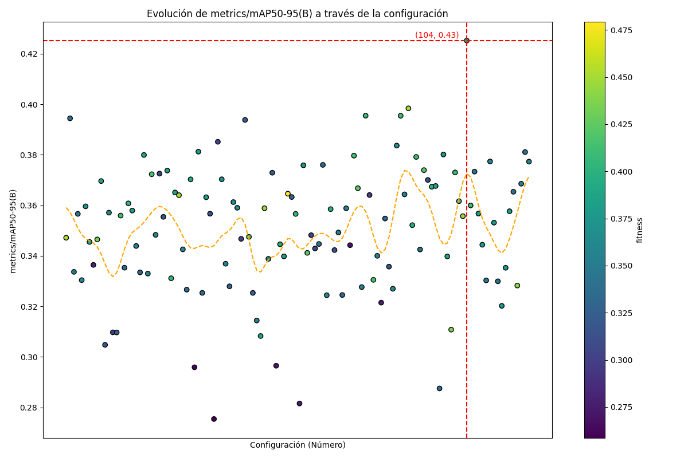
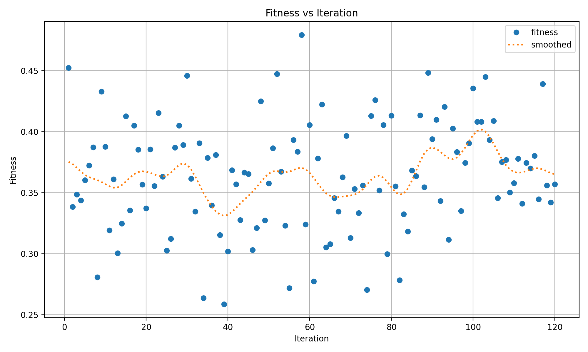
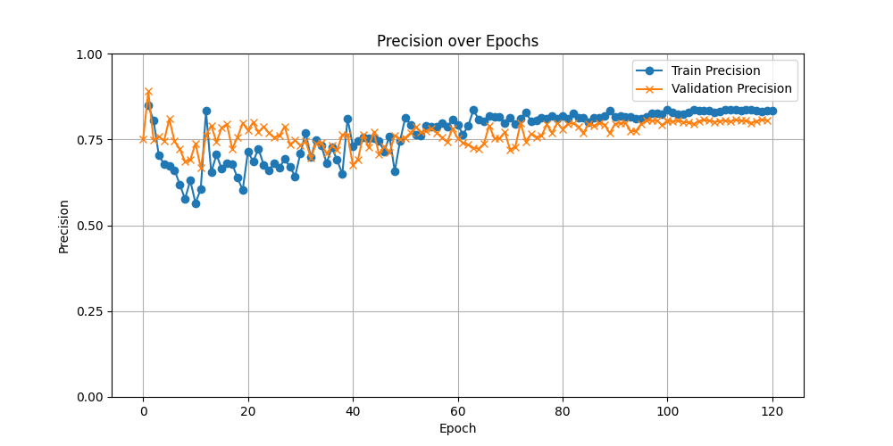

# Progresión Semana 8: 12/07 - 16/07

## Objetivos de la Semana

- [X] Ejecución del Algoritmo Genético con nueva función de `fitness` para la mejora del recall
- [X] Ajuste de número de épocas e iteraciones algoritmo genético

## Resultados GA: 80 épocas

Como se comentó en la semana anterior, se ha modificado la función de fitness de los individuos al medio, dándole más peso a la métrica recall dentro de la media ponderada devuelta:

```python
    def fitness(self):
        """Model fitness as a weighted combination of metrics."""
        w = [0.0, 0.9, 0.0, 0.1]  # weights for [P, R, mAP@0.5, mAP@0.5:0.95]
        return (np.array(self.mean_results()) * w).sum()
```

Para la ejecución del GA con esta nueva función de fitness en el SC Picasso se ha partido de la configuración óptima para el recall conseguida en el entrenamiento con la función de fitness por defecto, sin embargo, para que los resultados pudieran ser más fiables, pero que el tiempo de ejecución no supere los 3 días, se decidió dedicar `200` iteraciones a `50` épocas por iteración. Los resultados son los siguientes:


Como se puede observar, el recall ofrece una mejora sustancial, llegando a alcanzar un valor de `0.69` en la época 50 de ejecución. Este valor elevado, y que, si se observa la nube de puntos, parece ser un outlier, será tomado con precaución, ya que puede ser el producto de una configuración de pesos y sesgos afortunada en la red, es por esto que se ha probado a ejecutar por 120 épocas la configuración de hiperparámetros obtenida en esta época, con el fin de investigar si presenta una mejora tan optimista como la presentada en estos resultados.

### Resultados ejecución 120 épocas config83


| Metric          |   Mean |   Median |     Q1 |     Q3 |    Min |    Max |    Std |
|:----------------|-------:|---------:|-------:|-------:|-------:|-------:|-------:|
| Train precision | 0.6483 |   0.6454 | 0.5984 | 0.6774 | 0.5017 | 0.8125 | 0.0693 |
| Val precision   | 0.6678 |   0.6675 | 0.6552 | 0.678  | 0.5592 | 0.7758 | 0.032  |
| Train recall    | 0.4446 |   0.4606 | 0.4243 | 0.4673 | 0.1149 | 0.5158 | 0.048  |
| Val recall      | 0.329  |   0.3221 | 0.3187 | 0.3345 | 0.2691 | 0.3908 | 0.0165 |
| Train map_50    | 0.5625 |   0.578  | 0.5554 | 0.5922 | 0.1697 | 0.6017 | 0.0537 |
| Val map_50      | 0.5134 |   0.5172 | 0.5138 | 0.5244 | 0.3902 | 0.5385 | 0.0216 |
| Train map_50_95 | 0.2991 |   0.3086 | 0.296  | 0.3181 | 0.0769 | 0.3241 | 0.0323 |
| Val map_50_95   | 0.2716 |   0.2786 | 0.2719 | 0.2815 | 0.1862 | 0.2914 | 0.0205 |

Como se puede observar, los valores de recall presentan una mejora con respecto a los entrenamientos de hace unas semanas, presentando una estabilización de la métrica en entrenamiento al rededor de 0.5, y, en validación, al rededor de 0.33. Esto puede indicar que, efectivamente, el valor de 0.69 de recall obtenido mediante el GA podría deberse a una combinación afortunada de pesos y sesgos.

Para **evitar** que esto pueda pasar, o prevenirlo en la medida de lo posible, se va a realizar una ejecución del algoritmo genético partido de los valores de recall de la configuración 83 pero aumentando el número de épocas hasta `100` -y disminuyendo el número de iteraciones de manera consecuente para no aumentar demasiado el tiempo de ejecución. De esta forma se podrá mitigar el efecto aleatorio de los pesos y sesgos de la red, aumentando el número de épocas y dejando suficiente tiempo para que las métricas de estabilicen.

## Resultados GA: 100 épocas

Una vez utilizado como punto de partida los hiperparámetros de la configuración 83 del resultado del ajuste genético con 80 épocas anterior, se dio comienzo a un ajuste de 100 épocas, tratando de estabilizar los resultados en la medida de lo posible. El resultado de este ajuste es el siguiente:






Como se puede observarn, parece que se ha encontrado una meseta durante las 150 iteraciones de ejecución del algoritmo, fluctuando entre diversos valores de fitness que oscilan entre 0.3 y 0.45. Esto podría indicar que este método de ajuste no puede ofrecernos un margen de mejora mucho mayor al que hemos obtenido hasta ahora, encontrando el mejor fitness de la función en la iteración 58, con un valor de recall de 0.49 en la época 100. Se procederá entonces a, utilizando los pesos obtenidos en esa iteración y la configuración de hiperparámetros, realizar un entrenamiento/validación de los resultados.

### Resultados entrenamiento/validación





| Metric          |   Mean |   Median |     Q1 |     Q3 |    Min |    Max |    Std |
|:----------------|-------:|---------:|-------:|-------:|-------:|-------:|-------:|
| Train precision | 0.7672 |   0.8033 | 0.7136 | 0.8196 | 0.5644 | 0.8485 | 0.0709 |
| Val precision   | 0.7677 |   0.7706 | 0.7442 | 0.7975 | 0.6674 | 0.8897 | 0.0353 |
| Train recall    | 0.4345 |   0.4285 | 0.4167 | 0.4504 | 0.2522 | 0.5372 | 0.0292 |
| Val recall      | 0.2878 |   0.2838 | 0.2725 | 0.2973 | 0.2624 | 0.3559 | 0.0177 |
| Train map_50    | 0.6259 |   0.6342 | 0.6148 | 0.6383 | 0.5616 | 0.6573 | 0.0176 |
| Val map_50      | 0.5425 |   0.5452 | 0.536  | 0.5496 | 0.5023 | 0.5912 | 0.0125 |
| Train map_50_95 | 0.3658 |   0.3729 | 0.3565 | 0.3764 | 0.3185 | 0.3833 | 0.0149 |
| Val map_50_95   | 0.2819 |   0.2847 | 0.2765 | 0.2876 | 0.251  | 0.3085 | 0.0097 |

Como se puede observar, el rendimiento durante el entrenamiento de la red ha mejorado notablemente, tanto en recall como en las métricas mAP50-95 y mAP50, sin embargo, este rendimiento se ve reducido de manera significativa durante la validación de la red, llegando a recortar el recall hasta la mita de su valor. 

Como se puede observar en la convergencia de las funciones de pérdida, parece que el entrenamiento está lleno de fluctuaciones en `dfl`, mientras que las gráficas de validación también parecen exhibir problemas en la convergencia, llegando a estancarse en valores altos o no disminuir con las épocas.

