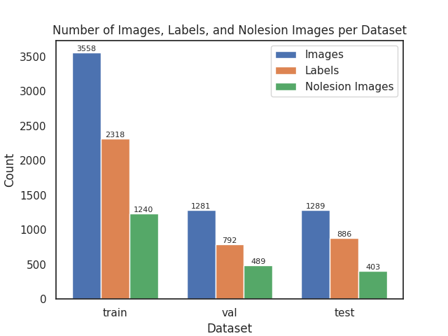
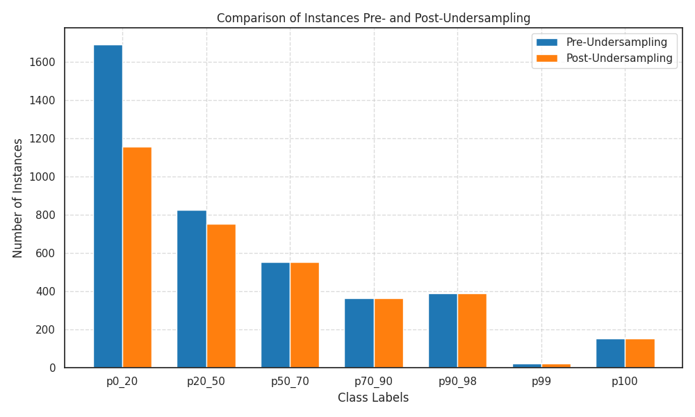
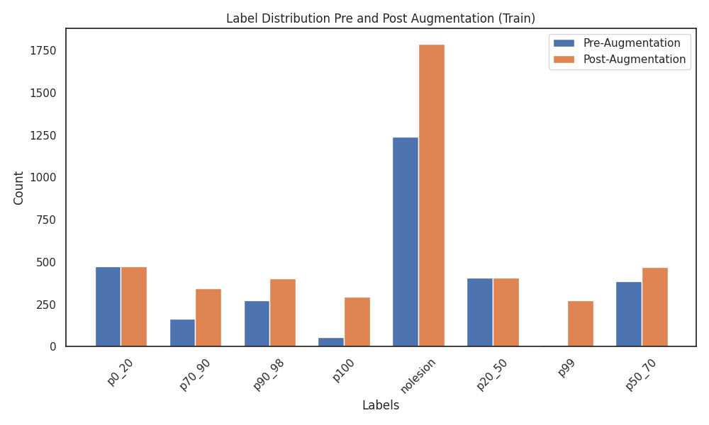
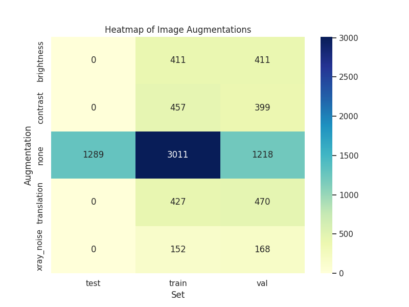
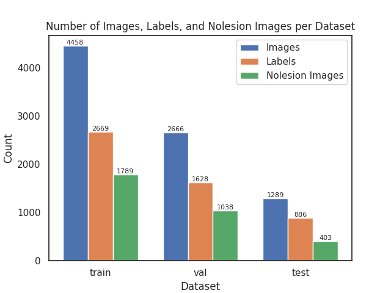
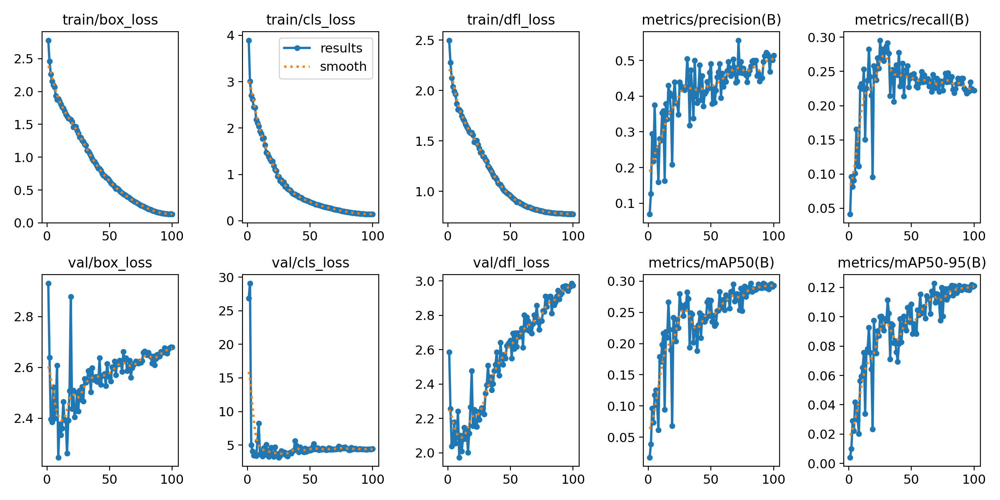
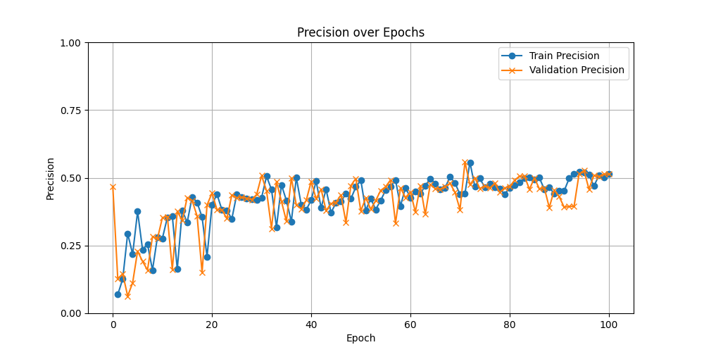
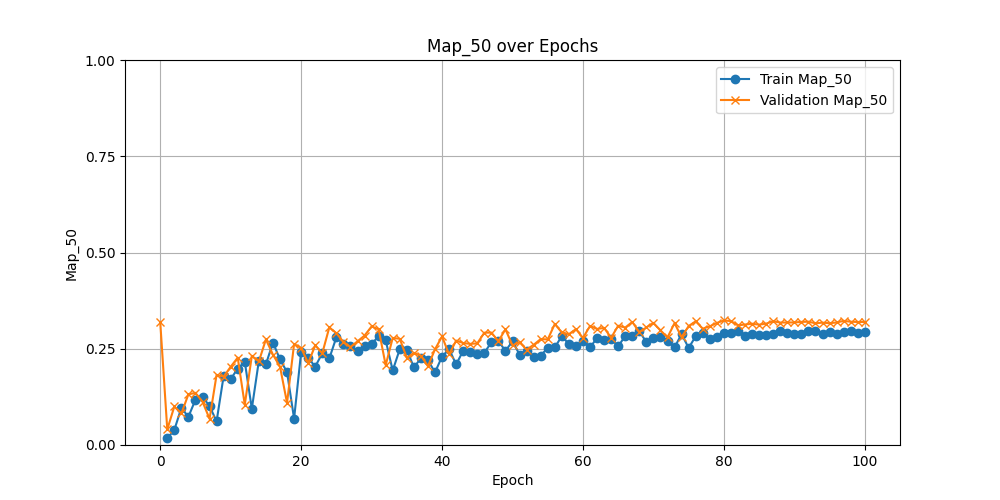

# Progresión Semana 9: 19/07 - 23/07

## Objetivos

- [ ] Comenzar un entrenamiento con todas las clases para establecer una base
- [ ] Mover el modulo external/ultralytics al servidor del ICAI para hacer una ejecución personalizada de GA priorizando recall

## Entrenamiento con todas las clases

Se va a seguir el siguiente enfoque:

1. Generar un conjunto de datos con todas las clases, **sin aumentación de datos**.
2. Evaluar el modelo base de YOLOv8 (hiperparámetros por defecto) con este conjunto de datos durante 100 épocas haciendo que se aplique también una clasificación multiclase, para identificar los desbalanceos del conjunto de datos y cómo afectan estos.
3. Realizar una evaluación base de YOLOv8 (hiperparámetros por defecto) con un conjunto de datos con 4 tipos de aumentaciones (*brillo, contraste, ruido de rayos x, y translaciones*) con las clases balanceadas. Este conjunto de datos balanceado deberá tener la misma cantidad de imágenes sin lesión e imágenes con lesión, intentando además mantener un reparto equitativo de imágenes aumentadas a través de las diferentes clases.
4. Comparar la mejora de clasificación para un `iou=0.5`.
5. Una vez seleccionado *y justificado* el conjunto de datos con mejor rendimiento sobre el modelo base, realizar un ajuste de hiperparámetros mediante el Algoritmo Genético (GA) ofrecido por Ultralytics sobre este conjunto de datos durante 100 épocas y 150 iteraciones.
6. Evaluar los resultados del GA en un entrenamiento/validación: Tomar `best.pt` y los hiperparámetros obtenidos para entrenar y validar durante 100 épocas.
7. Repetir estos pasos para los modelos YOLOv9 y YOLOv10.

Una vez terminado este proceso, se obtendrán métricas de rendimiento de los modelos YOLO considerados como el SOTA actual, además de dar perspectiva sobre su rendimiento en los diferentes conjuntos de datos.

### Organización del Cómputo

Actualmente se cuenta con dos computadores de procesamiento, el servidor TFG-ICAI, y el Supercomputador Picasso. El SP sería el único capaz de terminar la ejecución del algoritmo genético en un tiempo razonable, por lo que será reservado con este fin, mientras que el módulo TFG-ICAI será usado para el entranmiento preliminar con ambos conjuntos de datos.

## Conjuntos de Datos

Se parte de la siguiente distribución de clases en los conjuntos de datos:


### Sin aumentación (Por defecto)

El conjunto de datos al cual no se ha aplicado una aumentación y, por consecuente, tiene sus clases desbalanceadas, cuenta con la siguiente distribución en las diferentes particiones:




Como se puede observar, se trata de un conjunto desbalanceado en todos los aspectos, tanto en las propias clases de las imágenes con lesión, como en el balance de imágenes con lesión y sin lesión, es por ello que se esperan sesgos evidentes dentro de las predicciones del modelo. 

### Aumentado 

Para construir un conjunto de datos lo suficientemente balanceado se han requerido de dos principales técnicas:

1. **Undersampling**. La reducción de datos se ha realizado ignorando un porcentaje de muestras de la clase especificada para el partición indicado. Esto asegura que las clases como `p0_20`, que tienen una sobrerepresentación en cualquier partición de datos, puedan ser reducidas de manera precisa.

```python
class_undersampling = {
    "p0_20": [40, 12, 0], # 40% ignored in train, 12% in val, 0% in test 
    "p20_50": [10, 0, 0]  # 10% ignored in train, 0% in val, 0% in test  
}
```



2. **Oversampling**. El sobremuestreo de datos se ha realizado siguiendo 4 diferentes técnias de aumentación de datos comentadas en anteriores semanas: **variación de brillo y contraste, translación, y adición de ruido de sal y pimienta o rayos X**. Esta aumentación de datos se ha realizado ignorando las clases disminuídas y de manera indexada en las clases con menos representación, para que las clases más desfavorecidas tengan más representación.





La distribución final de este conjunto de datos es la siguiente:



Como se puede observar, este conjunto de datos tiene una distribución entre clases más equilibrada, asegurando además una distribución más equitativa también entre las imágenes con, y sin lesión.


## Resultados

### Conjunto de Datos Desbalanceado, Hiperparámetros por Defecto, Detección-Clasificación








| Metric          |   Mean |   Median |     Q1 |     Q3 |    Min |    Max |    Std |
|:----------------|-------:|---------:|-------:|-------:|-------:|-------:|-------:|
| Train precision | 0.4183 |   0.4404 | 0.3825 | 0.4749 | 0.069  | 0.557  | 0.091  |
| Val precision   | 0.4085 |   0.4305 | 0.3818 | 0.4683 | 0.0634 | 0.5581 | 0.0987 |
| Train recall    | 0.2271 |   0.2355 | 0.2244 | 0.2459 | 0.0412 | 0.2956 | 0.0459 |
| Val recall      | 0.2372 |   0.2383 | 0.2254 | 0.2553 | 0.0961 | 0.374  | 0.0365 |
| Train map_50    | 0.2399 |   0.257  | 0.2248 | 0.2831 | 0.0177 | 0.2964 | 0.0625 |
| Val map_50      | 0.2655 |   0.2818 | 0.2479 | 0.3129 | 0.0403 | 0.3234 | 0.064  |
| Train map_50_95 | 0.0939 |   0.1003 | 0.0827 | 0.1159 | 0.0041 | 0.1228 | 0.0283 |
| Val map_50_95   | 0.1084 |   0.1163 | 0.0968 | 0.1336 | 0.0106 | 0.1385 | 0.0305 |

Como se puede observar, no hay una clara convergencia en las funciones de pérdida del modelo. Se nos presenta el mismo problema que cuando solo se usaban las clases más notorias, y es que el recall es bajo, estabilizándose cerca de 0.25, mientras que la precisión es baja, y no parece estabilizarse, pero sí mostrar una tendencia a aumentar. 