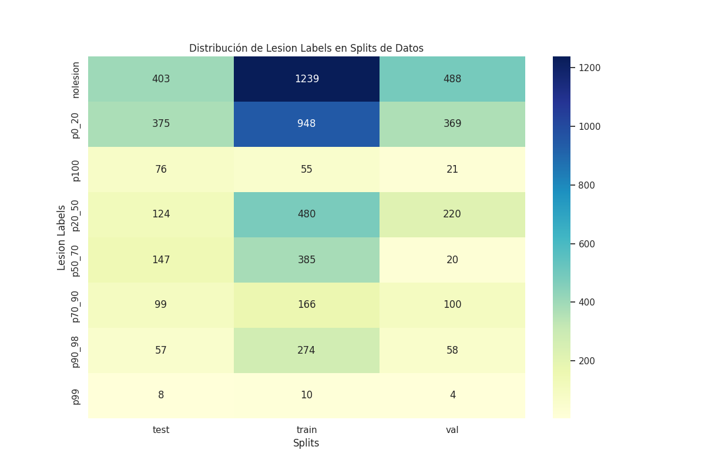
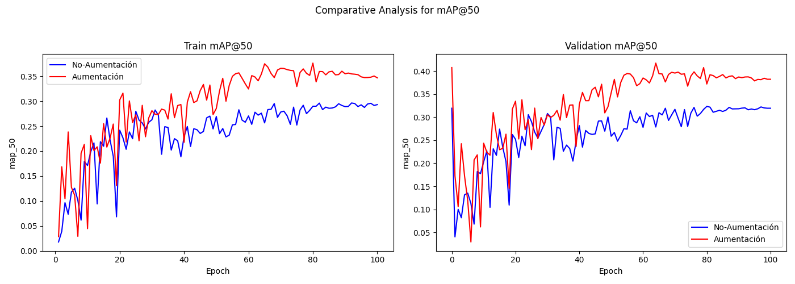
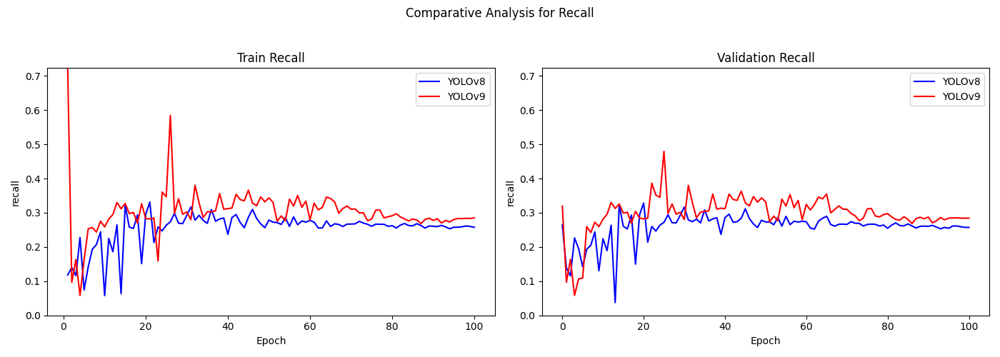
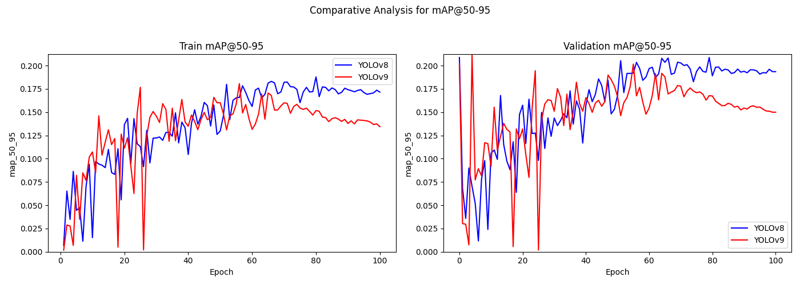

# Progresión Semana 9 y 10: 19/07 - 23/07 // 26/07 - 30/07

## Objetivos

- [X] Comenzar un entrenamiento con todas las clases para establecer una base

## Entrenamiento con todas las clases

Se va a seguir el siguiente enfoque:

1. Generar un conjunto de datos con todas las clases, **sin aumentación de datos**.
2. Evaluar el modelo base de YOLOv8 (hiperparámetros por defecto) con este conjunto de datos durante 100 épocas haciendo que se aplique también una clasificación multiclase, para identificar los desbalanceos del conjunto de datos y cómo afectan estos.
3. Realizar una evaluación base de YOLOv8 (hiperparámetros por defecto) con un conjunto de datos con 4 tipos de aumentaciones (*brillo, contraste, ruido de rayos x, y translaciones*) con las clases balanceadas. Este conjunto de datos balanceado deberá tener la misma cantidad de imágenes sin lesión e imágenes con lesión, intentando además mantener un reparto equitativo de imágenes aumentadas a través de las diferentes clases.
4. Comparar la mejora de clasificación para un `iou=0.5`.
5. Una vez seleccionado *y justificado* el conjunto de datos con mejor rendimiento sobre el modelo base, realizar un ajuste de hiperparámetros mediante el Algoritmo Genético (GA) ofrecido por Ultralytics sobre este conjunto de datos durante 100 épocas y 150 iteraciones.
6. Evaluar los resultados del GA en un entrenamiento/validación: Tomar `best.pt` y los hiperparámetros obtenidos para entrenar y validar durante 100 épocas.
7. Repetir estos pasos para los modelos YOLOv9 y YOLOv10.

Una vez terminado este proceso, se obtendrán métricas de rendimiento de los modelos YOLO considerados como el SOTA actual, además de dar perspectiva sobre su rendimiento en los diferentes conjuntos de datos.

### Organización del Cómputo

Actualmente se cuenta con dos computadores de procesamiento, el servidor TFG-ICAI, y el Supercomputador Picasso. El SP sería el único capaz de terminar la ejecución del algoritmo genético en un tiempo razonable, por lo que será reservado con este fin, mientras que el módulo TFG-ICAI será usado para el entranmiento preliminar con ambos conjuntos de datos.

## Conjuntos de Datos

Se parte de la siguiente distribución de clases en los conjuntos de datos:


### Sin aumentación (Por defecto)

El conjunto de datos al cual no se ha aplicado una aumentación y, por consecuente, tiene sus clases desbalanceadas, cuenta con la siguiente distribución en las diferentes particiones:




Como se puede observar, se trata de un conjunto desbalanceado en todos los aspectos, tanto en las propias clases de las imágenes con lesión, como en el balance de imágenes con lesión y sin lesión, es por ello que se esperan sesgos evidentes dentro de las predicciones del modelo.

### Aumentado

Para construir un conjunto de datos lo suficientemente balanceado se han requerido de dos principales técnicas:

1. **Undersampling**. La reducción de datos se ha realizado ignorando un porcentaje de muestras de la clase especificada para el partición indicado. Esto asegura que las clases como `p0_20`, que tienen una sobrerepresentación en cualquier partición de datos, puedan ser reducidas de manera precisa.

```python
class_undersampling = {
    "p0_20": [40, 12, 0], # 40% ignored in train, 12% in val, 0% in test 
    "p20_50": [10, 0, 0]  # 10% ignored in train, 0% in val, 0% in test  
}
```


2. **Oversampling**. El sobremuestreo de datos se ha realizado siguiendo 4 diferentes técnias de aumentación de datos comentadas en anteriores semanas: **variación de brillo y contraste, translación, y adición de ruido de sal y pimienta o rayos X**. Esta aumentación de datos se ha realizado ignorando las clases disminuídas y de manera indexada en las clases con menos representación, para que las clases más desfavorecidas tengan más representación.


La distribución final de este conjunto de datos es la siguiente:


Como se puede observar, este conjunto de datos tiene una distribución entre clases más equilibrada, asegurando además una distribución más equitativa también entre las imágenes con, y sin lesión.

## Resultados

### Conjunto de Datos Desbalanceado, Hiperparámetros por Defecto, Detección únicamente


| Metric          |   Mean |   Median |     Q1 |     Q3 |    Min |    Max |    Std |
|:----------------|-------:|---------:|-------:|-------:|-------:|-------:|-------:|
| Train precision | 0.4183 |   0.4404 | 0.3825 | 0.4749 | 0.069  | 0.557  | 0.091  |
| Val precision   | 0.4085 |   0.4305 | 0.3818 | 0.4683 | 0.0634 | 0.5581 | 0.0987 |
| Train recall    | 0.2271 |   0.2355 | 0.2244 | 0.2459 | 0.0412 | 0.2956 | 0.0459 |
| Val recall      | 0.2372 |   0.2383 | 0.2254 | 0.2553 | 0.0961 | 0.374  | 0.0365 |
| Train map_50    | 0.2399 |   0.257  | 0.2248 | 0.2831 | 0.0177 | 0.2964 | 0.0625 |
| Val map_50      | 0.2655 |   0.2818 | 0.2479 | 0.3129 | 0.0403 | 0.3234 | 0.064  |
| Train map_50_95 | 0.0939 |   0.1003 | 0.0827 | 0.1159 | 0.0041 | 0.1228 | 0.0283 |
| Val map_50_95   | 0.1084 |   0.1163 | 0.0968 | 0.1336 | 0.0106 | 0.1385 | 0.0305 |

Como se puede observar, no hay una clara convergencia en las funciones de pérdida del modelo. Se nos presenta el mismo problema que cuando solo se usaban las clases más notorias, y es que el recall es bajo, estabilizándose cerca de 0.25, mientras que la precisión es baja, y no parece estabilizarse, pero sí mostrar una tendencia a aumentar.

### Conjunto de Datos Balanceado, Hiperparámetros por Defecto, Detección Únicamente


| Metric          |   Mean |   Median |     Q1 |     Q3 |    Min |    Max |    Std |
|:----------------|-------:|---------:|-------:|-------:|-------:|-------:|-------:|
| Train precision | 0.4947 |   0.5404 | 0.46   | 0.5632 | 0.0678 | 0.6202 | 0.1098 |
| Val precision   | 0.4976 |   0.541  | 0.4616 | 0.5633 | 0.0661 | 0.6201 | 0.1079 |
| Train recall    | 0.2541 |   0.2647 | 0.2572 | 0.275  | 0.058  | 0.3311 | 0.0495 |
| Val recall      | 0.2577 |   0.2652 | 0.2572 | 0.2754 | 0.0376 | 0.3285 | 0.0428 |
| Train map_50    | 0.2951 |   0.3228 | 0.2657 | 0.3536 | 0.0284 | 0.3764 | 0.079  |
| Val map_50      | 0.3289 |   0.3674 | 0.2991 | 0.3874 | 0.0293 | 0.4175 | 0.081  |
| Train map_50_95 | 0.139  |   0.1565 | 0.1168 | 0.1723 | 0.0069 | 0.1878 | 0.0432 |
| Val map_50_95   | 0.1605 |   0.1842 | 0.1372 | 0.1942 | 0.0116 | 0.2087 | 0.0464 |

Como se puede observar, todas las métricas han mejorado de manera general por el hecho de balancear las clases, sin embargo, esta comparación se podrá observar de manera más detallada en la siguiente sección.

### Comparativa: Sin Aumentación | Aumentación ; Detección únicamente





Como se puede observar en las gráficas superiores, el conjunto de datos con aumentación supera en todos los aspectos al que no se le ha aplicado, confirmando que se continuará con este conjunto para todos los futuros ajustes.

### Conjunto de Datos Balanceado, Hiperparámetros por Defecto, Detección-Clasificación

Ajustando el hiperparámetro `single_cls` a `True` se puede permitir a la red clasificar las instancias una vez detectadas. Una vez realizado un entrenamiento con esta opción se puede observar cómo ha desarrollado la red esta tarea:


Como se puede observar, de manera general, los resultados empeoran a la hora de calcular las métricas teniendo en cuenta la tarea de clasificación de la lesión de la imagen. Se compararán estos resultados con los del conjunto de datos aumentado con la aumentación aplicada. 

### Comparativa: Detección | Detección-Clasificación ; Conjunto Aumentado


Como se puede observar, cargar a la red con la tarea de realizar una detección-clasificación empeora los resultados, es por esto que por ahora la tarea se centrará en la detección, dejando la tarea de clasificación para una posterior red neuronal que será creada específicamente con este objetivo.

## YOLOv9

Se ha realizado un entrenamiento base con YOLOv9 con la finalidad de comparar su rendimiento con YOLOv8 con este conjunto de datos. Los resultados individuales de YOLOv9 son los siguientes:

| Metric          |   Mean |   Median |     Q1 |     Q3 |    Min |    Max |    Std |
|:----------------|-------:|---------:|-------:|-------:|-------:|-------:|-------:|
| Train precision | 0.4356 |   0.4757 | 0.4334 | 0.4943 | 0.0025 | 0.5576 | 0.12   |
| Val precision   | 0.4476 |   0.4783 | 0.4413 | 0.4916 | 0.0058 | 0.6471 | 0.1058 |
| Train recall    | 0.302  |   0.2981 | 0.2812 | 0.3275 | 0.0582 | 0.7229 | 0.0704 |
| Val recall      | 0.2973 |   0.2979 | 0.2829 | 0.3244 | 0.0583 | 0.4797 | 0.0549 |
| Train map_50    | 0.29   |   0.3125 | 0.2965 | 0.3278 | 0.005  | 0.3764 | 0.0786 |
| Val map_50      | 0.316  |   0.3355 | 0.3174 | 0.3516 | 0.0043 | 0.4015 | 0.0768 |
| Train map_50_95 | 0.131  |   0.1421 | 0.1297 | 0.1511 | 0.0018 | 0.1806 | 0.0382 |
| Val map_50_95   | 0.1488 |   0.1583 | 0.1477 | 0.1692 | 0.0018 | 0.2121 | 0.0397 |


Como se puede observar, YOLOv9 parece haber obtendo unos resultados ligeramente superiores en cuanto a recall con la configuración base, compartida con YOLOv8. Esta comparación se verá apoyada con las siguientes gráficas:






Como se puede observar, YOLOv9 ha obtenido un mejor rendimiento en recall, aunque el intercambio por ello ha sido disminuir su precisión ligeramente. Se propondrá un ajuste de ambos modelos mediante el GA de Ultralytics para comprobar cuál es su capacidad máxima.

## YOLOv10

El último modelo del SOTA actual es YOLOv10. Se ha realizado un entrenamiento/validación con los hiperparámetros básicos de este modelo, pudiendo realizar una comparativa con sus modelos hermanos, v8 y v9:

| Metric          |   Mean |   Median |     Q1 |     Q3 |    Min |    Max |    Std |
|:----------------|-------:|---------:|-------:|-------:|-------:|-------:|-------:|
| Train precision | 0.4779 |   0.5056 | 0.4634 | 0.5294 | 0.0263 | 0.6038 | 0.0969 |
| Val precision   | 0.4613 |   0.4747 | 0.4401 | 0.5158 | 0.1006 | 0.6091 | 0.0906 |
| Train recall    | 0.2255 |   0.2304 | 0.2184 | 0.247  | 0.0265 | 0.2736 | 0.0399 |
| Val recall      | 0.2309 |   0.2376 | 0.2261 | 0.2521 | 0.0062 | 0.2824 | 0.0409 |
| Train map_50    | 0.2652 |   0.2858 | 0.2535 | 0.307  | 0.019  | 0.3198 | 0.063  |
| Val map_50      | 0.2952 |   0.318  | 0.2741 | 0.3408 | 0.0242 | 0.3573 | 0.0677 |
| Train map_50_95 | 0.1411 |   0.1552 | 0.1287 | 0.1673 | 0.0077 | 0.1817 | 0.0386 |
| Val map_50_95   | 0.1625 |   0.1797 | 0.1444 | 0.1925 | 0.01   | 0.2112 | 0.0435 |


Como se puede observar, el rendimiento de este modelo se asemeja más al rendimiento de YOLOv8, exhibiendo unas métricas ligeramente más bajas que YOLOv9. Esto se verá mejor en la siguiente comparativa:


